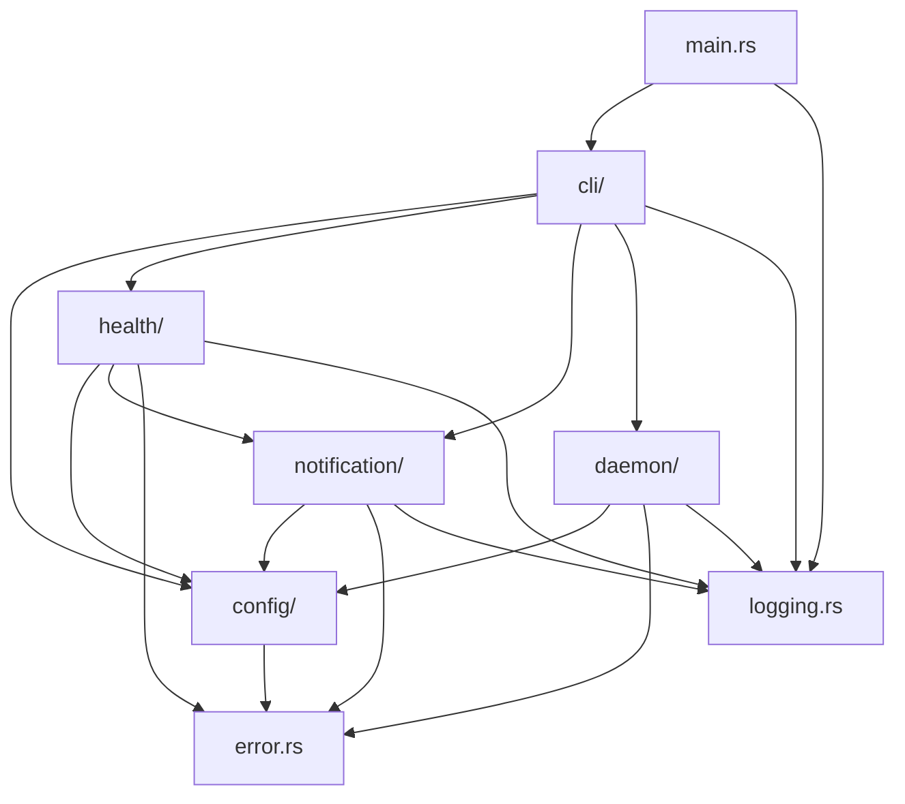

# Service Vitals - Rust服务健康检测工具开发文档

## 项目概述

Service Vitals 是一个跨平台（Linux/macOS）的命令行服务健康检测工具，使用Rust语言开发。该工具能够定期检测配置的服务URL，并在服务异常时通过飞书webhook发送告警消息。

### 核心特性
- 支持HTTP/HTTPS服务健康检测
- 可配置的检测间隔和状态码验证
- 飞书webhook告警通知
- TOML配置文件热重载
- 跨平台守护进程支持
- 完整的CLI命令集
- 优雅的错误处理和日志记录

## 1. 项目架构设计

### 1.1 整体架构

```
service-vitals/
├── src/
│   ├── main.rs                 # 程序入口点
│   ├── lib.rs                  # 库入口，导出公共接口
│   ├── cli/                    # CLI命令模块
│   │   ├── mod.rs
│   │   ├── commands.rs         # 命令定义和处理
│   │   └── args.rs             # 命令行参数解析
│   ├── config/                 # 配置管理模块
│   │   ├── mod.rs
│   │   ├── types.rs            # 配置数据结构
│   │   ├── loader.rs           # 配置文件加载
│   │   └── watcher.rs          # 配置文件热重载
│   ├── health/                 # 健康检测模块
│   │   ├── mod.rs
│   │   ├── checker.rs          # 健康检测核心逻辑
│   │   ├── scheduler.rs        # 检测任务调度
│   │   └── result.rs           # 检测结果数据结构
│   ├── notification/           # 通知系统模块
│   │   ├── mod.rs
│   │   ├── feishu.rs           # 飞书webhook通知
│   │   ├── template.rs         # 消息模板处理
│   │   └── sender.rs           # 通知发送器
│   ├── daemon/                 # 守护进程模块
│   │   ├── mod.rs
│   │   └── unix.rs             # Unix系统守护进程
│   ├── error.rs                # 错误类型定义
│   ├── logging.rs              # 日志配置
│   └── utils.rs                # 工具函数
├── tests/                      # 测试目录
├── examples/                   # 示例配置文件
├── docs/                       # 文档目录
└── scripts/                    # 部署脚本
```

### 1.2 模块职责定义

#### 1.2.1 CLI模块 (`cli/`)
**职责：** 处理命令行接口，解析用户输入，调用相应的业务逻辑模块。

**核心接口：**
```rust
pub trait Command {
    fn execute(&self, args: &Args) -> Result<()>;
}

pub struct CliApp {
    commands: HashMap<String, Box<dyn Command>>,
}
```

**主要功能：**
- 命令行参数解析和验证
- 命令路由和执行
- 用户交互和输出格式化

#### 1.2.2 配置管理模块 (`config/`)
**职责：** 管理TOML配置文件的加载、解析、验证和热重载。

**核心接口：**
```rust
pub trait ConfigLoader {
    fn load(&self, path: &Path) -> Result<Config>;
    fn validate(&self, config: &Config) -> Result<()>;
}

pub trait ConfigWatcher {
    fn watch(&self, path: &Path, callback: Box<dyn Fn(Config)>) -> Result<()>;
}
```

**主要功能：**
- TOML文件解析和反序列化
- 配置项验证和默认值处理
- 文件变化监听和热重载
- 配置合并和覆盖逻辑

#### 1.2.3 健康检测模块 (`health/`)
**职责：** 执行HTTP健康检测，管理检测任务调度，记录检测结果。

**核心接口：**
```rust
pub trait HealthChecker {
    async fn check(&self, service: &ServiceConfig) -> Result<HealthResult>;
}

pub trait Scheduler {
    async fn start(&self, services: Vec<ServiceConfig>) -> Result<()>;
    async fn stop(&self) -> Result<()>;
}
```

**主要功能：**
- HTTP/HTTPS请求发送和响应处理
- 状态码验证和响应时间测量
- 并发检测任务管理
- 检测结果缓存和历史记录

#### 1.2.4 通知系统模块 (`notification/`)
**职责：** 处理告警通知的发送，支持飞书webhook和消息模板。

**核心接口：**
```rust
pub trait NotificationSender {
    async fn send(&self, message: &NotificationMessage) -> Result<()>;
}

pub trait MessageTemplate {
    fn render(&self, context: &TemplateContext) -> Result<String>;
}
```

**主要功能：**
- 飞书webhook消息构建和发送
- 消息模板渲染和变量替换
- 发送失败重试和错误处理
- 告警频率控制和去重

#### 1.2.5 守护进程模块 (`daemon/`)
**职责：** 提供跨平台的守护进程/服务支持。

**核心接口：**
```rust
pub trait DaemonManager {
    fn daemonize(&self) -> Result<()>;
    fn install_service(&self, config: &ServiceConfig) -> Result<()>;
    fn uninstall_service(&self, name: &str) -> Result<()>;
}
```

**主要功能：**
- Unix系统守护进程创建
- 进程生命周期管理
- 信号处理和优雅关闭

### 1.3 模块依赖关系



### 1.4 数据流设计

1. **配置加载流程：**
   ```
   配置文件 → ConfigLoader → 验证 → Config对象 → 各模块
   ```

2. **健康检测流程：**
   ```
   Scheduler → HealthChecker → HTTP请求 → 结果验证 → HealthResult
   ```

3. **告警通知流程：**
   ```
   HealthResult → 告警判断 → MessageTemplate → NotificationSender → 飞书API
   ```

4. **配置热重载流程：**
   ```
   文件变化 → ConfigWatcher → 重新加载 → 更新运行时配置 → 重启检测任务
   ```

### 1.5 并发模型

- **异步运行时：** 使用 Tokio 作为异步运行时
- **任务调度：** 每个服务的健康检测作为独立的异步任务
- **配置热重载：** 独立的文件监听任务
- **通知发送：** 异步发送，避免阻塞主检测流程
- **资源共享：** 使用 Arc<RwLock<T>> 共享配置和状态

### 1.6 错误处理策略

- **统一错误类型：** 使用 `thiserror` 定义领域特定错误
- **错误传播：** 使用 `anyhow` 进行错误链传播
- **错误恢复：** 网络错误自动重试，配置错误停止服务
- **错误日志：** 所有错误都记录到日志系统

## 2. 技术栈选择

### 2.1 核心依赖

| 功能域     | Crate      | 版本  | 用途                    |
| ---------- | ---------- | ----- | ----------------------- |
| 异步运行时 | tokio      | ^1.0  | 异步任务调度和网络IO    |
| HTTP客户端 | reqwest    | ^0.11 | HTTP健康检测请求        |
| 序列化     | serde      | ^1.0  | 配置文件序列化/反序列化 |
| TOML解析   | toml       | ^0.8  | TOML配置文件解析        |
| CLI框架    | clap       | ^4.0  | 命令行参数解析          |
| 错误处理   | thiserror  | ^1.0  | 自定义错误类型          |
| 错误传播   | anyhow     | ^1.0  | 错误链和上下文          |
| 日志记录   | log        | ^0.4  | 日志接口                |
| 日志实现   | env_logger | ^0.10 | 日志实现                |
| 文件监听   | notify     | ^6.0  | 配置文件热重载          |
| 模板引擎   | handlebars | ^4.0  | 消息模板渲染            |

### 2.2 平台特定依赖

**Unix系统：**
- `nix` - Unix系统调用
- `daemonize` - 守护进程创建

### 2.3 开发和测试依赖

- `tokio-test` - 异步测试工具
- `mockito` - HTTP Mock服务器
- `tempfile` - 临时文件测试
- `criterion` - 性能基准测试

## 3. 性能和可扩展性考虑

### 3.1 性能目标

- **并发检测：** 支持同时检测100+服务
- **响应时间：** 单次检测延迟 < 5秒
- **内存使用：** 运行时内存 < 50MB
- **CPU使用：** 空闲时CPU使用率 < 1%

### 3.2 可扩展性设计

- **插件化通知：** 支持扩展其他通知渠道（邮件、短信等）
- **检测协议扩展：** 支持TCP、UDP等其他协议检测
- **存储后端：** 支持将检测结果存储到数据库
- **集群模式：** 支持多实例协调和负载均衡

## 4. 配置文件格式定义

### 4.1 TOML配置文件结构

配置文件采用TOML格式，包含全局配置和服务配置列表两个主要部分。

#### 4.1.1 完整配置示例

```toml
# 全局配置
[global]
# 默认飞书webhook URL（可选）
default_feishu_webhook_url = "https://open.feishu.cn/open-apis/bot/v2/hook/your-webhook-token"

# 消息模板（可选，使用Handlebars语法）
message_template = """
🚨 **服务告警**
- **服务名称**: {{service_name}}
- **服务URL**: {{service_url}}
- **状态码**: {{status_code}}
- **响应时间**: {{response_time}}ms
- **检测时间**: {{timestamp}}
- **错误信息**: {{error_message}}
"""

# 检测间隔，单位秒（默认60）
check_interval_seconds = 30

# 日志级别（可选，默认"info"）
log_level = "info"

# 请求超时时间，单位秒（默认10）
request_timeout_seconds = 10

# 全局请求头（可选）
[global.headers]
"User-Agent" = "ServiceVitals/1.0"
"Accept" = "application/json"

# 服务配置列表
[[services]]
name = "主站API"
url = "https://api.example.com/health"
method = "GET"
expected_status_codes = [200, 201]
failure_threshold = 2
check_interval_seconds = 60  # 覆盖全局配置

# 服务特定的请求头
[services.headers]
"Authorization" = "Bearer ${API_TOKEN}"
"Content-Type" = "application/json"

[[services]]
name = "用户服务"
url = "https://user-service.example.com/ping"
method = "POST"
expected_status_codes = [200]
feishu_webhook_url = "https://open.feishu.cn/open-apis/bot/v2/hook/user-service-webhook"
failure_threshold = 1

# POST请求体（可选）
[services.body]
ping = "pong"

[[services]]
name = "数据库连接检查"
url = "http://localhost:8080/db/health"
method = "GET"
expected_status_codes = [200]
failure_threshold = 3
# 使用全局飞书配置
```

#### 4.1.2 配置字段详细说明

##### 全局配置 (`[global]`)

| 字段名                       | 类型    | 必填 | 默认值   | 说明                                  |
| ---------------------------- | ------- | ---- | -------- | ------------------------------------- |
| `default_feishu_webhook_url` | String  | 否   | -        | 默认飞书webhook URL，服务未配置时使用 |
| `message_template`           | String  | 否   | 内置模板 | 告警消息模板，支持Handlebars语法      |
| `check_interval_seconds`     | Integer | 否   | 60       | 全局检测间隔，单位秒                  |
| `log_level`                  | String  | 否   | "info"   | 日志级别：debug/info/warn/error       |
| `request_timeout_seconds`    | Integer | 否   | 10       | HTTP请求超时时间，单位秒              |
| `max_concurrent_checks`      | Integer | 否   | 50       | 最大并发检测数量                      |
| `retry_attempts`             | Integer | 否   | 3        | 失败重试次数                          |
| `retry_delay_seconds`        | Integer | 否   | 5        | 重试间隔，单位秒                      |

##### 全局请求头 (`[global.headers]`)

可选的全局HTTP请求头，所有服务检测都会包含这些头部。支持环境变量替换。

##### 服务配置 (`[[services]]`)

| 字段名                   | 类型           | 必填 | 默认值   | 说明                              |
| ------------------------ | -------------- | ---- | -------- | --------------------------------- |
| `name`                   | String         | 是   | -        | 服务名称，用于日志和告警消息      |
| `url`                    | String         | 是   | -        | 服务健康检测URL                   |
| `method`                 | String         | 否   | "GET"    | HTTP请求方法：GET/POST/PUT/DELETE |
| `expected_status_codes`  | Array<Integer> | 是   | -        | 期望的HTTP状态码列表              |
| `feishu_webhook_url`     | String         | 否   | 全局配置 | 服务特定的飞书webhook URL         |
| `failure_threshold`      | Integer        | 否   | 1        | 连续失败多少次后发送告警          |
| `check_interval_seconds` | Integer        | 否   | 全局配置 | 服务特定的检测间隔                |
| `enabled`                | Boolean        | 否   | true     | 是否启用该服务检测                |
| `description`            | String         | 否   | -        | 服务描述信息                      |

##### 服务请求头 (`[services.headers]`)

服务特定的HTTP请求头，会与全局请求头合并，服务配置优先级更高。

##### 服务请求体 (`[services.body]`)

用于POST/PUT请求的请求体，支持JSON格式。

### 4.2 配置验证规则

#### 4.2.1 必填字段验证
- 每个服务必须有 `name` 和 `url`
- 每个服务必须有 `expected_status_codes`
- URL必须是有效的HTTP/HTTPS地址

#### 4.2.2 数值范围验证
- `check_interval_seconds`: 1-3600秒
- `request_timeout_seconds`: 1-300秒
- `failure_threshold`: 1-100次
- `max_concurrent_checks`: 1-1000个
- `retry_attempts`: 0-10次

#### 4.2.3 枚举值验证
- `method`: GET, POST, PUT, DELETE, HEAD, OPTIONS
- `log_level`: debug, info, warn, error

#### 4.2.4 URL格式验证
- 服务URL必须以http://或https://开头
- 飞书webhook URL必须是有效的HTTPS地址

### 4.3 环境变量支持

配置文件支持环境变量替换，使用 `${VAR_NAME}` 语法：

```toml
[global.headers]
"Authorization" = "Bearer ${API_TOKEN}"

[[services]]
name = "生产环境API"
url = "${PROD_API_URL}/health"
```

支持的环境变量格式：
- `${VAR_NAME}` - 必须存在的环境变量
- `${VAR_NAME:-default}` - 带默认值的环境变量
- `${VAR_NAME:?error_message}` - 不存在时显示错误信息

### 4.4 配置文件Schema定义

```json
{
  "$schema": "http://json-schema.org/draft-07/schema#",
  "title": "Service Vitals Configuration",
  "type": "object",
  "properties": {
    "global": {
      "type": "object",
      "properties": {
        "default_feishu_webhook_url": {
          "type": "string",
          "format": "uri",
          "pattern": "^https://"
        },
        "message_template": {
          "type": "string",
          "minLength": 1
        },
        "check_interval_seconds": {
          "type": "integer",
          "minimum": 1,
          "maximum": 3600
        },
        "log_level": {
          "type": "string",
          "enum": ["debug", "info", "warn", "error"]
        },
        "request_timeout_seconds": {
          "type": "integer",
          "minimum": 1,
          "maximum": 300
        },
        "headers": {
          "type": "object",
          "additionalProperties": {
            "type": "string"
          }
        }
      }
    },
    "services": {
      "type": "array",
      "minItems": 1,
      "items": {
        "type": "object",
        "required": ["name", "url", "expected_status_codes"],
        "properties": {
          "name": {
            "type": "string",
            "minLength": 1
          },
          "url": {
            "type": "string",
            "format": "uri",
            "pattern": "^https?://"
          },
          "method": {
            "type": "string",
            "enum": ["GET", "POST", "PUT", "DELETE", "HEAD", "OPTIONS"]
          },
          "expected_status_codes": {
            "type": "array",
            "minItems": 1,
            "items": {
              "type": "integer",
              "minimum": 100,
              "maximum": 599
            }
          },
          "failure_threshold": {
            "type": "integer",
            "minimum": 1,
            "maximum": 100
          }
        }
      }
    }
  },
  "required": ["services"]
}
```

## 5. CLI命令接口设计

### 5.1 命令行工具概述

Service Vitals 提供完整的CLI命令集，支持服务的启动、配置管理、状态查询等功能。所有命令都遵循Unix命令行工具的设计原则。

### 5.2 全局选项

所有命令都支持以下全局选项：

| 选项        | 短选项 | 类型   | 默认值          | 说明                 |
| ----------- | ------ | ------ | --------------- | -------------------- |
| `--help`    | `-h`   | Flag   | -               | 显示帮助信息         |
| `--version` | `-V`   | Flag   | -               | 显示版本信息         |
| `--verbose` | `-v`   | Flag   | -               | 启用详细输出         |
| `--quiet`   | `-q`   | Flag   | -               | 静默模式，只输出错误 |
| `--config`  | `-c`   | String | `./config.toml` | 指定配置文件路径     |

### 5.3 命令详细设计

#### 5.3.1 help 命令

**功能：** 显示帮助信息和所有可用命令。

**语法：**
```bash
# Linux/macOS (Bash)
service-vitals help [COMMAND]
```

```powershell
# Windows (PowerShell)
service-vitals help [COMMAND]
```

**参数：**
- `COMMAND` (可选): 显示特定命令的详细帮助

**示例：**
```bash
# Linux/macOS (Bash)
service-vitals help
service-vitals help start
service-vitals help init
```

```powershell
# Windows (PowerShell)
service-vitals help
service-vitals help start
service-vitals help init
```

**输出格式：**
```
Service Vitals v1.0.0 - 服务健康检测工具

USAGE:
    service-vitals [OPTIONS] <COMMAND>

COMMANDS:
    help      显示帮助信息
    init      生成示例配置文件
    start     启动监控服务
    service   生成系统服务配置
    reload    热重载配置文件
    status    显示运行状态

OPTIONS:
    -h, --help       显示帮助信息
    -V, --version    显示版本信息
    -v, --verbose    启用详细输出
    -q, --quiet      静默模式
    -c, --config     指定配置文件路径 [default: ./config.toml]
```

#### 5.3.2 init 命令

**功能：** 生成示例TOML配置文件模板。

**语法：**
```bash
# Linux/macOS (Bash)
service-vitals init [OPTIONS]
```

```powershell
# Windows (PowerShell)
service-vitals init [OPTIONS]
```

**选项：**

| 选项         | 短选项 | 类型   | 默认值        | 说明                             |
| ------------ | ------ | ------ | ------------- | -------------------------------- |
| `--output`   | `-o`   | String | `config.toml` | 输出文件路径                     |
| `--force`    | `-f`   | Flag   | -             | 覆盖已存在的文件                 |
| `--template` | `-t`   | String | `basic`       | 模板类型：basic/advanced/minimal |

**示例：**
```bash
# Linux/macOS (Bash)
service-vitals init
service-vitals init --output /etc/service-vitals/config.toml
service-vitals init --template advanced --force
```

```powershell
# Windows (PowerShell)
service-vitals init
service-vitals init --output "C:\ProgramData\ServiceVitals\config.toml"
service-vitals init --template advanced --force
```

**模板类型说明：**
- `basic`: 基础模板，包含1-2个示例服务
- `advanced`: 高级模板，包含多种配置示例
- `minimal`: 最小模板，只包含必要字段

#### 5.3.3 start 命令

**功能：** 启动监控服务。

**语法：**
```bash
# Linux/macOS (Bash)
service-vitals start [OPTIONS]
```

```powershell
# Windows (PowerShell)
service-vitals start [OPTIONS]
```

**选项：**

| 选项         | 短选项 | 类型   | 默认值 | 说明                         |
| ------------ | ------ | ------ | ------ | ---------------------------- |
| `--daemon`   | `-d`   | Flag   | -      | 以守护进程模式运行（仅Unix） |
| `--pid-file` | `-p`   | String | -      | PID文件路径（守护进程模式）  |
| `--log-file` | `-l`   | String | -      | 日志文件路径                 |
| `--dry-run`  | -      | Flag   | -      | 验证配置但不启动服务         |

**示例：**
```bash
# Linux/macOS (Bash)
service-vitals start
service-vitals start --config /etc/service-vitals/config.toml
service-vitals start --daemon --pid-file /var/run/service-vitals.pid
service-vitals start --dry-run
```

```powershell
# Windows (PowerShell)
service-vitals start
service-vitals start --config "C:\ProgramData\ServiceVitals\config.toml"
service-vitals start --dry-run
```

**行为说明：**
- 默认在前台运行，显示实时日志
- `--daemon` 选项仅在Unix系统有效
- Windows下建议使用 `service install` 命令安装为系统服务
- `--dry-run` 模式验证配置文件并显示将要监控的服务列表

#### 5.3.4 service 命令

**功能：** 生成系统服务配置文件。

**语法：**
```bash
# Linux/macOS (Bash)
service-vitals service [SUBCOMMAND] [OPTIONS]
```

```powershell
# Windows (PowerShell)
service-vitals service [SUBCOMMAND] [OPTIONS]
```

**子命令：**

##### install 子命令
安装为系统服务。

**选项：**

| 选项            | 短选项 | 类型   | 默认值           | 说明               |
| --------------- | ------ | ------ | ---------------- | ------------------ |
| `--name`        | `-n`   | String | `service-vitals` | 服务名称           |
| `--user`        | `-u`   | String | `root`           | 运行用户（仅Unix） |
| `--description` | -      | String | -                | 服务描述           |

**示例：**
```bash
# Linux/macOS (Bash)
sudo service-vitals service install
sudo service-vitals service install --name health-monitor --user vitals
```

```powershell
# Windows (PowerShell，以管理员身份运行)
service-vitals service install
service-vitals service install --name "Health Monitor"
```

##### uninstall 子命令
卸载系统服务。

**示例：**
```bash
# Linux/macOS (Bash)
sudo service-vitals service uninstall
sudo service-vitals service uninstall --name health-monitor
```

```powershell
# Windows (PowerShell，以管理员身份运行)
service-vitals service uninstall
service-vitals service uninstall --name "Health Monitor"
```

##### generate 子命令
生成服务配置文件模板。

**选项：**

| 选项       | 短选项 | 类型   | 默认值    | 说明                           |
| ---------- | ------ | ------ | --------- | ------------------------------ |
| `--output` | `-o`   | String | -         | 输出文件路径                   |
| `--type`   | `-t`   | String | `systemd` | 服务类型：systemd/sysv/windows |

**示例：**
```bash
# Linux/macOS (Bash)
service-vitals service generate --type systemd --output service-vitals.service
service-vitals service generate --type sysv --output /etc/init.d/service-vitals
```

```powershell
# Windows (PowerShell)
service-vitals service generate --type windows --output service-vitals.xml
```

#### 5.3.5 reload 命令

**功能：** 热重载配置文件，无需重启服务。

**语法：**
```bash
# Linux/macOS (Bash)
service-vitals reload [OPTIONS]
```

```powershell
# Windows (PowerShell)
service-vitals reload [OPTIONS]
```

**选项：**

| 选项         | 短选项 | 类型   | 默认值 | 说明                     |
| ------------ | ------ | ------ | ------ | ------------------------ |
| `--signal`   | `-s`   | String | `HUP`  | 发送的信号类型（仅Unix） |
| `--pid-file` | `-p`   | String | -      | PID文件路径              |

**示例：**
```bash
# Linux/macOS (Bash)
service-vitals reload
service-vitals reload --config /etc/service-vitals/config.toml
service-vitals reload --pid-file /var/run/service-vitals.pid
```

```powershell
# Windows (PowerShell)
service-vitals reload
service-vitals reload --config "C:\ProgramData\ServiceVitals\config.toml"
```

**行为说明：**
- 重新加载配置文件并验证
- 更新运行时配置，重启检测任务
- 不中断正在进行的健康检测
- 如果配置无效，保持原有配置继续运行

#### 5.3.6 status 命令

**功能：** 显示当前运行状态和监控的服务列表。

**语法：**
```bash
# Linux/macOS (Bash)
service-vitals status [OPTIONS]
```

```powershell
# Windows (PowerShell)
service-vitals status [OPTIONS]
```

**选项：**

| 选项         | 短选项 | 类型    | 默认值  | 说明                      |
| ------------ | ------ | ------- | ------- | ------------------------- |
| `--format`   | `-f`   | String  | `table` | 输出格式：table/json/yaml |
| `--watch`    | `-w`   | Flag    | -       | 持续监控模式，实时更新    |
| `--interval` | `-i`   | Integer | 5       | 监控更新间隔（秒）        |

**示例：**
```bash
# Linux/macOS (Bash)
service-vitals status
service-vitals status --format json
service-vitals status --watch --interval 10
```

```powershell
# Windows (PowerShell)
service-vitals status
service-vitals status --format json
service-vitals status --watch --interval 10
```

**输出格式示例：**

**表格格式 (默认):**
```
Service Vitals Status Report
Generated: 2023-10-27 14:30:25

┌─────────────────┬──────────────────────────────────┬────────┬─────────────────────┬─────────────┬──────────────┐
│ Service Name    │ URL                              │ Status │ Last Check          │ Status Code │ Response Time│
├─────────────────┼──────────────────────────────────┼────────┼─────────────────────┼─────────────┼──────────────┤
│ 主站API         │ https://api.example.com/health   │ ✅ UP   │ 2023-10-27 14:30:20 │ 200         │ 145ms        │
│ 用户服务        │ https://user-service.example.com │ ❌ DOWN │ 2023-10-27 14:30:15 │ 500         │ 2.3s         │
│ 数据库连接检查  │ http://localhost:8080/db/health  │ ✅ UP   │ 2023-10-27 14:30:18 │ 200         │ 23ms         │
└─────────────────┴──────────────────────────────────┴────────┴─────────────────────┴─────────────┴──────────────┘

Summary:
- Total Services: 3
- Healthy: 2 (66.7%)
- Unhealthy: 1 (33.3%)
- Last Config Reload: 2023-10-27 14:25:10
```

**JSON格式:**
```json
{
  "timestamp": "2023-10-27T14:30:25Z",
  "summary": {
    "total_services": 3,
    "healthy_count": 2,
    "unhealthy_count": 1,
    "last_config_reload": "2023-10-27T14:25:10Z"
  },
  "services": [
    {
      "name": "主站API",
      "url": "https://api.example.com/health",
      "status": "UP",
      "last_check": "2023-10-27T14:30:20Z",
      "status_code": 200,
      "response_time_ms": 145,
      "consecutive_failures": 0
    }
  ]
}
```

### 5.4 退出码定义

所有命令都遵循标准的Unix退出码约定：

| 退出码 | 含义     | 说明                 |
| ------ | -------- | -------------------- |
| 0      | 成功     | 命令执行成功         |
| 1      | 一般错误 | 命令执行失败         |
| 2      | 参数错误 | 命令行参数无效       |
| 3      | 配置错误 | 配置文件无效或不存在 |
| 4      | 权限错误 | 权限不足             |
| 5      | 网络错误 | 网络连接失败         |
| 130    | 用户中断 | 用户按Ctrl+C中断     |

### 5.5 环境变量支持

CLI工具支持以下环境变量：

| 环境变量                   | 默认值          | 说明             |
| -------------------------- | --------------- | ---------------- |
| `SERVICE_VITALS_CONFIG`    | `./config.toml` | 默认配置文件路径 |
| `SERVICE_VITALS_LOG_LEVEL` | `info`          | 默认日志级别     |
| `SERVICE_VITALS_PID_FILE`  | -               | 默认PID文件路径  |
| `SERVICE_VITALS_LOG_FILE`  | -               | 默认日志文件路径 |

### 5.6 Shell补全支持

工具支持为主流Shell生成自动补全脚本：

```bash
# Linux/macOS (Bash)
service-vitals completions bash > /etc/bash_completion.d/service-vitals
service-vitals completions zsh > ~/.zsh/completions/_service-vitals
service-vitals completions fish > ~/.config/fish/completions/service-vitals.fish
```

```powershell
# Windows (PowerShell)
service-vitals completions powershell > $PROFILE.CurrentUserAllHosts
```

## 6. 核心功能模块实现计划

### 6.1 健康检测模块 (`health/`)

#### 6.1.1 模块架构设计

健康检测模块负责执行HTTP健康检测，管理检测任务调度，记录检测结果。

**核心组件：**

1. **HealthChecker** - 健康检测执行器
2. **Scheduler** - 任务调度器
3. **HealthResult** - 检测结果数据结构
4. **CheckTask** - 单个检测任务

#### 6.1.2 HealthChecker 实现方案

**职责：**
- 执行单次HTTP健康检测
- 处理请求超时和重试逻辑
- 验证响应状态码和内容
- 记录检测指标

**核心接口设计：**
```rust
#[async_trait]
pub trait HealthChecker: Send + Sync {
    async fn check(&self, service: &ServiceConfig) -> Result<HealthResult>;
    async fn check_with_timeout(&self, service: &ServiceConfig, timeout: Duration) -> Result<HealthResult>;
}

pub struct HttpHealthChecker {
    client: reqwest::Client,
    metrics: Arc<Metrics>,
}
```

**实现要点：**

1. **HTTP客户端配置：**
   - 使用 `reqwest::Client` 作为HTTP客户端
   - 配置连接池大小和超时时间
   - 支持HTTP/2和连接复用
   - 自定义User-Agent和请求头

2. **请求构建：**
   - 根据服务配置构建HTTP请求
   - 支持GET、POST、PUT、DELETE等方法
   - 处理请求头合并（全局+服务特定）
   - 支持JSON请求体序列化

3. **响应处理：**
   - 测量响应时间（从发送请求到接收响应）
   - 验证状态码是否在期望范围内
   - 可选的响应体内容验证
   - 处理重定向和SSL证书验证

4. **错误处理：**
   - 网络连接错误
   - DNS解析失败
   - 请求超时
   - SSL/TLS握手失败
   - 服务器返回错误状态码

#### 6.1.3 Scheduler 实现方案

**职责：**
- 管理多个服务的检测任务
- 按配置的间隔调度检测
- 处理并发检测限制
- 管理任务生命周期

**核心接口设计：**
```rust
#[async_trait]
pub trait Scheduler: Send + Sync {
    async fn start(&self, services: Vec<ServiceConfig>) -> Result<()>;
    async fn stop(&self) -> Result<()>;
    async fn reload_config(&self, services: Vec<ServiceConfig>) -> Result<()>;
    async fn get_status(&self) -> SchedulerStatus;
}

pub struct TaskScheduler {
    checker: Arc<dyn HealthChecker>,
    notifier: Arc<dyn NotificationSender>,
    tasks: Arc<RwLock<HashMap<String, JoinHandle<()>>>>,
    config: Arc<RwLock<GlobalConfig>>,
}
```

**实现要点：**

1. **任务调度策略：**
   - 每个服务独立的异步任务
   - 使用 `tokio::time::interval` 实现定时调度
   - 支持不同服务的不同检测间隔
   - 避免所有服务同时检测（错峰调度）

2. **并发控制：**
   - 使用 `Semaphore` 限制并发检测数量
   - 防止资源耗尽和网络拥塞
   - 支持动态调整并发限制

3. **任务管理：**
   - 使用 `HashMap<String, JoinHandle<()>>` 管理任务
   - 支持动态添加/删除服务
   - 优雅关闭所有任务

4. **配置热重载：**
   - 监听配置变化事件
   - 比较新旧配置差异
   - 只重启变化的服务任务

#### 6.1.4 HealthResult 数据结构

**设计目标：**
- 记录完整的检测结果信息
- 支持序列化和反序列化
- 便于日志记录和通知

**数据结构设计：**
```rust
#[derive(Debug, Clone, Serialize, Deserialize)]
pub struct HealthResult {
    pub service_name: String,
    pub service_url: String,
    pub timestamp: DateTime<Utc>,
    pub status: HealthStatus,
    pub status_code: Option<u16>,
    pub response_time: Duration,
    pub error_message: Option<String>,
    pub consecutive_failures: u32,
}

#[derive(Debug, Clone, Serialize, Deserialize)]
pub enum HealthStatus {
    Up,
    Down,
    Unknown,
}
```

#### 6.1.5 性能优化策略

1. **连接复用：**
   - 使用连接池减少连接建立开销
   - 配置合适的连接超时和保活时间

2. **内存管理：**
   - 限制检测历史记录数量
   - 使用环形缓冲区存储最近的检测结果

3. **网络优化：**
   - 支持HTTP/2协议
   - 启用gzip压缩
   - 配置合适的TCP参数

### 6.2 通知系统模块 (`notification/`)

#### 6.2.1 模块架构设计

通知系统负责处理告警通知的发送，支持飞书webhook和消息模板。

**核心组件：**

1. **NotificationSender** - 通知发送器接口
2. **FeishuSender** - 飞书webhook实现
3. **MessageTemplate** - 消息模板处理器
4. **NotificationQueue** - 通知队列管理

#### 6.2.2 NotificationSender 实现方案

**核心接口设计：**
```rust
#[async_trait]
pub trait NotificationSender: Send + Sync {
    async fn send(&self, message: &NotificationMessage) -> Result<()>;
    async fn send_batch(&self, messages: &[NotificationMessage]) -> Result<()>;
    fn supports_format(&self, format: &MessageFormat) -> bool;
}

#[derive(Debug, Clone)]
pub struct NotificationMessage {
    pub title: String,
    pub content: String,
    pub format: MessageFormat,
    pub priority: Priority,
    pub webhook_url: String,
}
```

#### 6.2.3 FeishuSender 实现方案

**职责：**
- 构建飞书webhook消息格式
- 发送HTTP POST请求到飞书API
- 处理发送失败和重试逻辑
- 支持富文本和卡片消息

**实现要点：**

1. **消息格式构建：**
   - 支持文本消息和富文本消息
   - 构建飞书卡片消息格式
   - 处理特殊字符转义

2. **HTTP请求处理：**
   - 使用 `reqwest` 发送POST请求
   - 设置正确的Content-Type头
   - 处理飞书API的响应格式

3. **错误处理和重试：**
   - 指数退避重试策略
   - 区分临时错误和永久错误
   - 记录发送失败的详细信息

#### 6.2.4 MessageTemplate 实现方案

**职责：**
- 解析和渲染消息模板
- 支持变量替换和条件逻辑
- 提供内置模板和自定义模板

**实现要点：**

1. **模板引擎选择：**
   - 使用 `handlebars` crate 作为模板引擎
   - 支持变量替换、条件判断、循环等
   - 提供自定义helper函数

2. **模板变量：**
   ```rust
   #[derive(Serialize)]
   pub struct TemplateContext {
       pub service_name: String,
       pub service_url: String,
       pub status_code: Option<u16>,
       pub response_time: String,
       pub timestamp: String,
       pub error_message: Option<String>,
       pub consecutive_failures: u32,
   }
   ```

3. **内置模板：**
   - 提供默认的告警消息模板
   - 支持不同严重级别的模板
   - 模板国际化支持

### 6.3 配置管理模块 (`config/`)

#### 6.3.1 模块架构设计

配置管理模块负责TOML配置文件的加载、解析、验证和热重载。

**核心组件：**

1. **ConfigLoader** - 配置加载器
2. **ConfigWatcher** - 配置文件监听器
3. **ConfigValidator** - 配置验证器
4. **Config** - 配置数据结构

#### 6.3.2 ConfigLoader 实现方案

**职责：**
- 加载和解析TOML配置文件
- 处理环境变量替换
- 合并默认配置和用户配置
- 配置项验证

**实现要点：**

1. **TOML解析：**
   - 使用 `toml` crate 解析配置文件
   - 使用 `serde` 进行反序列化
   - 处理解析错误和类型转换

2. **环境变量替换：**
   - 支持 `${VAR_NAME}` 语法
   - 支持默认值 `${VAR_NAME:-default}`
   - 支持错误消息 `${VAR_NAME:?error}`

3. **配置合并：**
   - 全局配置和服务配置合并
   - 服务配置覆盖全局配置
   - 处理配置继承关系

#### 6.3.3 ConfigWatcher 实现方案

**职责：**
- 监听配置文件变化
- 触发配置重新加载
- 处理文件系统事件

**实现要点：**

1. **文件监听：**
   - 使用 `notify` crate 监听文件变化
   - 处理文件修改、删除、重命名事件
   - 支持符号链接和网络文件系统

2. **事件处理：**
   - 防抖动处理（避免频繁重载）
   - 异步事件处理
   - 错误恢复机制

3. **热重载流程：**
   ```
   文件变化 → 延迟处理 → 加载配置 → 验证配置 → 更新运行时 → 重启任务
   ```

#### 6.3.4 配置数据结构设计

**完整的配置数据结构：**
```rust
#[derive(Debug, Clone, Serialize, Deserialize)]
pub struct Config {
    pub global: GlobalConfig,
    pub services: Vec<ServiceConfig>,
}

#[derive(Debug, Clone, Serialize, Deserialize)]
pub struct GlobalConfig {
    pub default_feishu_webhook_url: Option<String>,
    pub message_template: Option<String>,
    pub check_interval_seconds: u64,
    pub log_level: String,
    pub request_timeout_seconds: u64,
    pub max_concurrent_checks: usize,
    pub retry_attempts: u32,
    pub retry_delay_seconds: u64,
    pub headers: HashMap<String, String>,
}

#[derive(Debug, Clone, Serialize, Deserialize)]
pub struct ServiceConfig {
    pub name: String,
    pub url: String,
    pub method: String,
    pub expected_status_codes: Vec<u16>,
    pub feishu_webhook_url: Option<String>,
    pub failure_threshold: u32,
    pub check_interval_seconds: Option<u64>,
    pub enabled: bool,
    pub description: Option<String>,
    pub headers: HashMap<String, String>,
    pub body: Option<serde_json::Value>,
}
```

### 6.4 跨平台守护进程模块 (`daemon/`)

#### 6.4.1 模块架构设计

守护进程模块提供跨平台的后台服务支持，包括Unix守护进程和Windows服务。

**核心组件：**

1. **DaemonManager** - 守护进程管理器接口
2. **UnixDaemon** - Unix系统守护进程实现
3. **WindowsService** - Windows服务实现
4. **ServiceInstaller** - 服务安装器

#### 6.4.2 Unix守护进程实现

**实现要点：**

1. **守护进程创建：**
   - Fork进程并退出父进程
   - 创建新的会话和进程组
   - 重定向标准输入/输出/错误
   - 设置工作目录和文件权限掩码

2. **信号处理：**
   - SIGTERM: 优雅关闭
   - SIGHUP: 重新加载配置
   - SIGINT: 立即关闭
   - SIGUSR1/SIGUSR2: 自定义信号

3. **PID文件管理：**
   - 创建和锁定PID文件
   - 防止多实例运行
   - 进程退出时清理PID文件

#### 6.4.3 Windows服务实现

**实现要点：**

1. **服务注册：**
   - 使用Windows Service API
   - 配置服务启动类型和依赖
   - 设置服务描述和恢复选项

2. **服务控制：**
   - 响应服务控制管理器命令
   - 处理启动、停止、暂停、继续
   - 报告服务状态

3. **事件日志：**
   - 写入Windows事件日志
   - 配置事件源和类别
   - 支持不同日志级别

### 6.5 错误处理和日志系统

#### 6.5.1 统一错误类型设计

**错误类型层次：**
```rust
#[derive(Debug, thiserror::Error)]
pub enum ServiceVitalsError {
    #[error("配置错误: {0}")]
    Config(#[from] ConfigError),

    #[error("网络错误: {0}")]
    Network(#[from] NetworkError),

    #[error("通知错误: {0}")]
    Notification(#[from] NotificationError),

    #[error("IO错误: {0}")]
    Io(#[from] std::io::Error),

    #[error("序列化错误: {0}")]
    Serialization(#[from] serde_json::Error),
}

#[derive(Debug, thiserror::Error)]
pub enum ConfigError {
    #[error("配置文件不存在: {path}")]
    FileNotFound { path: String },

    #[error("配置文件格式错误: {message}")]
    ParseError { message: String },

    #[error("配置验证失败: {field}: {message}")]
    ValidationError { field: String, message: String },
}
```

#### 6.5.2 日志系统设计

**日志配置：**
```rust
pub struct LogConfig {
    pub level: log::LevelFilter,
    pub target: LogTarget,
    pub format: LogFormat,
    pub rotation: Option<LogRotation>,
}

pub enum LogTarget {
    Console,
    File(PathBuf),
    Syslog,
    Both(Box<LogTarget>, Box<LogTarget>),
}
```

**日志格式：**
- 结构化日志（JSON格式）
- 人类可读格式
- 包含时间戳、级别、模块、消息
- 支持上下文信息（trace_id等）

### 6.6 性能监控和指标

#### 6.6.1 指标收集

**核心指标：**
```rust
#[derive(Debug, Clone)]
pub struct Metrics {
    pub total_checks: AtomicU64,
    pub successful_checks: AtomicU64,
    pub failed_checks: AtomicU64,
    pub average_response_time: AtomicU64,
    pub notifications_sent: AtomicU64,
    pub config_reloads: AtomicU64,
}
```

**指标类型：**
- 计数器：检测次数、成功/失败次数
- 直方图：响应时间分布
- 仪表盘：当前活跃连接数
- 摘要：响应时间百分位数

#### 6.6.2 健康检查端点

**内置HTTP服务器：**
- `/health` - 服务自身健康状态
- `/metrics` - Prometheus格式指标
- `/status` - 详细状态信息
- `/config` - 当前配置信息（脱敏）

### 6.7 安全考虑

#### 6.7.1 配置安全

1. **敏感信息保护：**
   - 配置文件权限控制（600）
   - 环境变量存储敏感信息
   - 内存中敏感数据清零

2. **输入验证：**
   - URL格式验证
   - 配置参数范围检查
   - 防止路径遍历攻击

#### 6.7.2 网络安全

1. **HTTPS支持：**
   - 强制HTTPS连接
   - 证书验证
   - TLS版本限制

2. **请求安全：**
   - 请求头过滤
   - 请求体大小限制
   - 超时控制

### 6.8 测试策略

#### 6.8.1 单元测试

**测试覆盖范围：**
- 配置解析和验证
- HTTP客户端模拟
- 消息模板渲染
- 错误处理逻辑

**测试工具：**
- `mockito` - HTTP Mock服务器
- `tempfile` - 临时文件测试
- `tokio-test` - 异步测试

#### 6.8.2 集成测试

**测试场景：**
- 端到端健康检测流程
- 配置热重载功能
- 通知发送功能
- 守护进程模式

#### 6.8.3 性能测试

**测试指标：**
- 并发检测性能
- 内存使用情况
- CPU使用率
- 网络延迟影响

## 7. 错误处理和日志策略

### 7.1 错误处理架构

#### 7.1.1 错误分类体系

Service Vitals 采用分层的错误处理架构，将错误按照领域和严重程度进行分类：

**错误层次结构：**
```rust
// 顶层错误类型
#[derive(Debug, thiserror::Error)]
pub enum ServiceVitalsError {
    #[error("配置错误")]
    Config(#[from] ConfigError),

    #[error("健康检测错误")]
    HealthCheck(#[from] HealthCheckError),

    #[error("通知发送错误")]
    Notification(#[from] NotificationError),

    #[error("守护进程错误")]
    Daemon(#[from] DaemonError),

    #[error("系统错误")]
    System(#[from] SystemError),
}

// 配置相关错误
#[derive(Debug, thiserror::Error)]
pub enum ConfigError {
    #[error("配置文件不存在: {path}")]
    FileNotFound { path: String },

    #[error("配置文件解析失败: {source}")]
    ParseFailed { source: toml::de::Error },

    #[error("配置验证失败: {field} - {message}")]
    ValidationFailed { field: String, message: String },

    #[error("环境变量未找到: {var_name}")]
    EnvVarNotFound { var_name: String },

    #[error("配置文件权限不足: {path}")]
    PermissionDenied { path: String },
}

// 健康检测错误
#[derive(Debug, thiserror::Error)]
pub enum HealthCheckError {
    #[error("网络连接失败: {url} - {source}")]
    NetworkFailed { url: String, source: reqwest::Error },

    #[error("请求超时: {url} - 超时时间: {timeout_ms}ms")]
    Timeout { url: String, timeout_ms: u64 },

    #[error("状态码不匹配: 期望 {expected:?}, 实际 {actual}")]
    StatusCodeMismatch { expected: Vec<u16>, actual: u16 },

    #[error("DNS解析失败: {hostname}")]
    DnsResolutionFailed { hostname: String },

    #[error("SSL/TLS错误: {url} - {message}")]
    TlsError { url: String, message: String },
}
```

#### 7.1.2 错误恢复策略

**错误恢复级别：**

1. **自动恢复（Auto Recovery）**
   - 网络临时故障
   - DNS解析超时
   - 服务临时不可用
   - 策略：指数退避重试

2. **降级服务（Graceful Degradation）**
   - 通知发送失败
   - 部分服务检测失败
   - 策略：跳过失败项，继续其他服务

3. **停止服务（Fail Fast）**
   - 配置文件严重错误
   - 权限不足
   - 系统资源耗尽
   - 策略：记录错误，优雅退出

#### 7.1.3 错误上下文管理

**上下文信息收集：**
```rust
#[derive(Debug, Clone)]
pub struct ErrorContext {
    pub service_name: Option<String>,
    pub operation: String,
    pub timestamp: DateTime<Utc>,
    pub trace_id: String,
    pub additional_info: HashMap<String, String>,
}

impl ErrorContext {
    pub fn new(operation: &str) -> Self {
        Self {
            service_name: None,
            operation: operation.to_string(),
            timestamp: Utc::now(),
            trace_id: generate_trace_id(),
            additional_info: HashMap::new(),
        }
    }

    pub fn with_service(mut self, service_name: &str) -> Self {
        self.service_name = Some(service_name.to_string());
        self
    }

    pub fn add_info(mut self, key: &str, value: &str) -> Self {
        self.additional_info.insert(key.to_string(), value.to_string());
        self
    }
}
```

### 7.2 日志系统设计

#### 7.2.1 日志架构

**日志组件：**
```rust
pub struct LoggingSystem {
    pub config: LogConfig,
    pub writers: Vec<Box<dyn LogWriter>>,
    pub formatter: Box<dyn LogFormatter>,
    pub filter: LogFilter,
}

#[derive(Debug, Clone)]
pub struct LogConfig {
    pub level: log::LevelFilter,
    pub targets: Vec<LogTarget>,
    pub format: LogFormat,
    pub rotation: Option<LogRotation>,
    pub buffer_size: usize,
    pub flush_interval: Duration,
}

#[derive(Debug, Clone)]
pub enum LogTarget {
    Console {
        colored: bool,
    },
    File {
        path: PathBuf,
        rotation: Option<LogRotation>,
    },
    Syslog {
        facility: syslog::Facility,
        hostname: Option<String>,
    },
    Network {
        endpoint: String,
        protocol: NetworkProtocol,
    },
}
```

#### 7.2.2 日志级别和分类

**日志级别定义：**

| 级别  | 用途                   | 示例                         |
| ----- | ---------------------- | ---------------------------- |
| ERROR | 错误事件，需要立即关注 | 服务检测失败、配置错误       |
| WARN  | 警告事件，可能影响功能 | 重试次数过多、配置项缺失     |
| INFO  | 重要信息事件           | 服务启动、配置重载、检测结果 |
| DEBUG | 调试信息               | 请求详情、内部状态变化       |
| TRACE | 详细跟踪信息           | 函数调用、变量值             |

**日志分类：**
```rust
#[derive(Debug, Clone)]
pub enum LogCategory {
    System,      // 系统级别日志
    Config,      // 配置相关日志
    HealthCheck, // 健康检测日志
    Notification,// 通知相关日志
    Performance, // 性能指标日志
    Security,    // 安全相关日志
}
```

#### 7.2.3 结构化日志格式

**JSON格式日志：**
```json
{
  "timestamp": "2023-10-27T14:30:25.123Z",
  "level": "INFO",
  "category": "HealthCheck",
  "message": "服务检测完成",
  "service_name": "主站API",
  "service_url": "https://api.example.com/health",
  "status_code": 200,
  "response_time_ms": 145,
  "trace_id": "abc123def456",
  "thread_id": "tokio-runtime-worker-1",
  "module": "service_vitals::health::checker"
}
```

**人类可读格式：**
```
2023-10-27 14:30:25.123 [INFO ] [HealthCheck] 服务检测完成 service=主站API status=200 time=145ms trace=abc123def456
```

#### 7.2.4 日志轮转和归档

**轮转策略：**
```rust
#[derive(Debug, Clone)]
pub enum LogRotation {
    Size {
        max_size: u64,        // 最大文件大小（字节）
        max_files: u32,       // 保留文件数量
    },
    Time {
        interval: Duration,   // 轮转间隔
        max_age: Duration,    // 最大保留时间
    },
    Daily {
        hour: u8,            // 轮转时间（小时）
        max_days: u32,       // 保留天数
    },
}
```

**文件命名规则：**
- 当前日志：`service-vitals.log`
- 轮转日志：`service-vitals.log.2023-10-27`
- 压缩归档：`service-vitals.log.2023-10-26.gz`

### 7.3 监控和告警

#### 7.3.1 错误监控

**错误指标收集：**
```rust
#[derive(Debug, Clone)]
pub struct ErrorMetrics {
    pub total_errors: AtomicU64,
    pub errors_by_type: HashMap<String, AtomicU64>,
    pub errors_by_service: HashMap<String, AtomicU64>,
    pub error_rate: AtomicF64,
    pub last_error_time: AtomicU64,
}
```

**错误阈值告警：**
- 错误率超过阈值（如5%）
- 连续错误次数过多
- 特定错误类型频发
- 系统资源不足

#### 7.3.2 日志监控

**日志监控指标：**
- 日志产生速率
- 错误日志比例
- 日志文件大小
- 磁盘空间使用

**异常检测：**
- 日志量突然增加
- 错误模式识别
- 性能指标异常
- 安全事件检测

### 7.4 调试和故障排查

#### 7.4.1 调试模式

**调试功能：**
```rust
#[derive(Debug, Clone)]
pub struct DebugConfig {
    pub enabled: bool,
    pub trace_requests: bool,
    pub dump_config: bool,
    pub verbose_errors: bool,
    pub performance_profiling: bool,
}
```

**调试输出：**
- 详细的请求/响应信息
- 配置文件解析过程
- 任务调度详情
- 内存使用情况

#### 7.4.2 故障排查工具

**内置诊断命令：**
```bash
# Linux/macOS (Bash)
service-vitals diagnose --config /path/to/config.toml
service-vitals diagnose --network --service "主站API"
service-vitals diagnose --permissions
```

```powershell
# Windows (PowerShell)
service-vitals diagnose --config "C:\path\to\config.toml"
service-vitals diagnose --network --service "主站API"
service-vitals diagnose --permissions
```

**诊断检查项：**
- 配置文件语法和语义检查
- 网络连接测试
- 权限验证
- 依赖服务状态
- 系统资源检查

### 7.5 性能监控

#### 7.5.1 性能指标

**核心性能指标：**
```rust
#[derive(Debug, Clone)]
pub struct PerformanceMetrics {
    // 响应时间指标
    pub avg_response_time: AtomicU64,
    pub p50_response_time: AtomicU64,
    pub p95_response_time: AtomicU64,
    pub p99_response_time: AtomicU64,

    // 吞吐量指标
    pub requests_per_second: AtomicF64,
    pub successful_requests: AtomicU64,
    pub failed_requests: AtomicU64,

    // 资源使用指标
    pub memory_usage: AtomicU64,
    pub cpu_usage: AtomicF64,
    pub active_connections: AtomicU32,

    // 业务指标
    pub services_up: AtomicU32,
    pub services_down: AtomicU32,
    pub notifications_sent: AtomicU64,
}
```

#### 7.5.2 性能分析

**性能分析工具：**
- 响应时间分布直方图
- 请求量时间序列
- 错误率趋势分析
- 资源使用趋势

**性能优化建议：**
- 并发数调优
- 超时时间优化
- 连接池配置
- 内存使用优化

## 8. 测试计划和部署方案

### 8.1 测试策略概述

Service Vitals 采用多层次的测试策略，确保代码质量和系统可靠性：

1. **单元测试** - 测试单个模块和函数
2. **集成测试** - 测试模块间协作
3. **端到端测试** - 测试完整业务流程
4. **性能测试** - 验证性能指标
5. **兼容性测试** - 验证跨平台兼容性

### 8.2 单元测试计划

#### 8.2.1 测试覆盖范围

**配置模块测试：**
```rust
#[cfg(test)]
mod config_tests {
    use super::*;
    use tempfile::NamedTempFile;

    #[test]
    fn test_config_parsing() {
        // 测试TOML配置文件解析
    }

    #[test]
    fn test_config_validation() {
        // 测试配置验证逻辑
    }

    #[test]
    fn test_env_var_substitution() {
        // 测试环境变量替换
    }

    #[test]
    fn test_config_merging() {
        // 测试配置合并逻辑
    }
}
```

**健康检测模块测试：**
```rust
#[cfg(test)]
mod health_check_tests {
    use super::*;
    use mockito::{mock, Matcher};
    use tokio_test;

    #[tokio::test]
    async fn test_successful_health_check() {
        // 测试成功的健康检测
        let _m = mock("GET", "/health")
            .with_status(200)
            .with_header("content-type", "application/json")
            .with_body(r#"{"status": "ok"}"#)
            .create();

        // 执行测试逻辑
    }

    #[tokio::test]
    async fn test_timeout_handling() {
        // 测试超时处理
    }

    #[tokio::test]
    async fn test_retry_logic() {
        // 测试重试逻辑
    }

    #[tokio::test]
    async fn test_status_code_validation() {
        // 测试状态码验证
    }
}
```

**通知模块测试：**
```rust
#[cfg(test)]
mod notification_tests {
    use super::*;

    #[tokio::test]
    async fn test_feishu_message_formatting() {
        // 测试飞书消息格式化
    }

    #[tokio::test]
    async fn test_template_rendering() {
        // 测试消息模板渲染
    }

    #[tokio::test]
    async fn test_notification_retry() {
        // 测试通知重试机制
    }

    #[test]
    fn test_message_template_validation() {
        // 测试模板验证
    }
}
```

#### 8.2.2 测试工具和框架

**核心测试依赖：**
```toml
[dev-dependencies]
tokio-test = "0.4"
mockito = "1.0"
tempfile = "3.0"
criterion = "0.5"
proptest = "1.0"
serial_test = "3.0"
```

**测试辅助工具：**
```rust
// 测试配置生成器
pub struct TestConfigBuilder {
    config: Config,
}

impl TestConfigBuilder {
    pub fn new() -> Self {
        Self {
            config: Config::default(),
        }
    }

    pub fn with_service(mut self, name: &str, url: &str) -> Self {
        self.config.services.push(ServiceConfig {
            name: name.to_string(),
            url: url.to_string(),
            ..Default::default()
        });
        self
    }

    pub fn build(self) -> Config {
        self.config
    }
}

// Mock HTTP服务器
pub struct MockServer {
    server: mockito::ServerGuard,
}

impl MockServer {
    pub fn new() -> Self {
        Self {
            server: mockito::Server::new(),
        }
    }

    pub fn mock_health_endpoint(&mut self, status: u16, body: &str) -> mockito::Mock {
        self.server.mock("GET", "/health")
            .with_status(status)
            .with_body(body)
            .create()
    }
}
```

#### 8.2.3 测试数据管理

**测试数据目录结构：**
```
tests/
├── data/
│   ├── configs/
│   │   ├── valid_config.toml
│   │   ├── invalid_config.toml
│   │   └── minimal_config.toml
│   ├── templates/
│   │   ├── basic_template.hbs
│   │   └── advanced_template.hbs
│   └── responses/
│       ├── success_response.json
│       └── error_response.json
├── fixtures/
│   ├── mod.rs
│   └── test_data.rs
└── integration/
    ├── health_check_tests.rs
    └── notification_tests.rs
```

### 8.3 集成测试计划

#### 8.3.1 测试场景设计

**配置热重载测试：**
```rust
#[tokio::test]
async fn test_config_hot_reload() {
    // 1. 启动服务
    // 2. 修改配置文件
    // 3. 验证配置重新加载
    // 4. 验证服务列表更新
    // 5. 验证新配置生效
}
```

**端到端健康检测流程：**
```rust
#[tokio::test]
async fn test_end_to_end_health_check() {
    // 1. 启动Mock服务器
    // 2. 配置健康检测服务
    // 3. 启动监控
    // 4. 验证检测执行
    // 5. 验证结果记录
    // 6. 模拟服务故障
    // 7. 验证告警发送
}
```

**通知系统集成测试：**
```rust
#[tokio::test]
async fn test_notification_integration() {
    // 1. 配置飞书webhook
    // 2. 模拟服务故障
    // 3. 验证告警触发
    // 4. 验证消息格式
    // 5. 验证重试机制
}
```

#### 8.3.2 测试环境搭建

**Docker测试环境：**
```dockerfile
# Dockerfile.test
FROM rust:1.70-slim

WORKDIR /app
COPY . .

# 安装测试依赖
RUN apt-get update && apt-get install -y \
    curl \
    netcat \
    && rm -rf /var/lib/apt/lists/*

# 运行测试
CMD ["cargo", "test", "--all-features"]
```

**Docker Compose测试配置：**
```yaml
version: '3.8'
services:
  service-vitals-test:
    build:
      context: .
      dockerfile: Dockerfile.test
    environment:
      - RUST_LOG=debug
      - TEST_MODE=true
    volumes:
      - ./tests:/app/tests
      - ./target:/app/target

  mock-service:
    image: nginx:alpine
    ports:
      - "8080:80"
    volumes:
      - ./tests/mock-responses:/usr/share/nginx/html

  feishu-mock:
    image: mockserver/mockserver:latest
    ports:
      - "1080:1080"
    environment:
      - MOCKSERVER_LOG_LEVEL=INFO
```

### 8.4 性能测试计划

#### 8.4.1 性能测试指标

**关键性能指标：**
- 并发检测能力：支持100+服务同时检测
- 响应时间：单次检测 < 5秒
- 内存使用：运行时 < 50MB
- CPU使用：空闲时 < 1%
- 通知延迟：故障检测到通知发送 < 10秒

#### 8.4.2 性能测试工具

**Criterion基准测试：**
```rust
use criterion::{black_box, criterion_group, criterion_main, Criterion};

fn bench_health_check(c: &mut Criterion) {
    let rt = tokio::runtime::Runtime::new().unwrap();
    let checker = HttpHealthChecker::new();
    let service = ServiceConfig {
        name: "test".to_string(),
        url: "http://localhost:8080/health".to_string(),
        ..Default::default()
    };

    c.bench_function("health_check", |b| {
        b.to_async(&rt).iter(|| async {
            black_box(checker.check(&service).await)
        })
    });
}

criterion_group!(benches, bench_health_check);
criterion_main!(benches);
```

**负载测试脚本：**
```bash
#!/bin/bash
# Linux/macOS (Bash)

# 启动多个并发检测
for i in {1..100}; do
    service-vitals start --config "test_configs/service_$i.toml" &
done

# 监控系统资源
while true; do
    echo "$(date): CPU: $(top -bn1 | grep "Cpu(s)" | awk '{print $2}'), Memory: $(free -m | awk 'NR==2{printf "%.1f%%", $3*100/$2}')"
    sleep 5
done
```

```powershell
# Windows (PowerShell)

# 启动多个并发检测
1..100 | ForEach-Object {
    Start-Process -FilePath "service-vitals" -ArgumentList "start", "--config", "test_configs\service_$_.toml" -NoNewWindow
}

# 监控系统资源
while ($true) {
    $cpu = Get-Counter "\Processor(_Total)\% Processor Time" | Select-Object -ExpandProperty CounterSamples | Select-Object -ExpandProperty CookedValue
    $memory = Get-Counter "\Memory\Available MBytes" | Select-Object -ExpandProperty CounterSamples | Select-Object -ExpandProperty CookedValue
    Write-Host "$(Get-Date): CPU: $([math]::Round($cpu, 2))%, Available Memory: $memory MB"
    Start-Sleep -Seconds 5
}
```

### 8.5 跨平台部署方案

#### 8.5.1 构建和打包

**跨平台构建配置：**
```toml
# Cargo.toml
[package]
name = "service-vitals"
version = "1.0.0"
edition = "2021"

[[bin]]
name = "service-vitals"
path = "src/main.rs"

[target.'cfg(unix)'.dependencies]
nix = "0.27"
daemonize = "0.5"

[target.'cfg(windows)'.dependencies]
windows-service = "0.6"
winapi = { version = "0.3", features = ["winuser", "winsvc"] }
```

**GitHub Actions构建流水线：**
```yaml
name: Build and Release

on:
  push:
    tags:
      - 'v*'

jobs:
  build:
    strategy:
      matrix:
        include:
          - os: ubuntu-latest
            target: x86_64-unknown-linux-gnu
            artifact_name: service-vitals
            asset_name: service-vitals-linux-x86_64
          - os: windows-latest
            target: x86_64-pc-windows-msvc
            artifact_name: service-vitals.exe
            asset_name: service-vitals-windows-x86_64.exe
          - os: macos-latest
            target: x86_64-apple-darwin
            artifact_name: service-vitals
            asset_name: service-vitals-macos-x86_64

    runs-on: ${{ matrix.os }}

    steps:
    - uses: actions/checkout@v3

    - name: Install Rust
      uses: actions-rs/toolchain@v1
      with:
        toolchain: stable
        target: ${{ matrix.target }}
        override: true

    - name: Build
      run: cargo build --release --target ${{ matrix.target }}

    - name: Upload artifact
      uses: actions/upload-artifact@v3
      with:
        name: ${{ matrix.asset_name }}
        path: target/${{ matrix.target }}/release/${{ matrix.artifact_name }}
```

#### 8.5.2 Linux部署方案

**Systemd服务单元文件：**
```ini
[Unit]
Description=Service Vitals - Health Check Monitor
After=network.target
Wants=network.target

[Service]
Type=simple
User=vitals
Group=vitals
ExecStart=/usr/local/bin/service-vitals start --config /etc/service-vitals/config.toml
ExecReload=/bin/kill -HUP $MAINPID
Restart=always
RestartSec=5
StandardOutput=journal
StandardError=journal
SyslogIdentifier=service-vitals

# 安全设置
NoNewPrivileges=true
PrivateTmp=true
ProtectSystem=strict
ProtectHome=true
ReadWritePaths=/var/log/service-vitals /var/lib/service-vitals

[Install]
WantedBy=multi-user.target
```

**安装脚本：**
```bash
#!/bin/bash
# Linux/macOS (Bash) - install.sh

set -e

# 检查权限
if [[ $EUID -ne 0 ]]; then
   echo "此脚本需要root权限运行"
   exit 1
fi

# 创建用户和组
useradd -r -s /bin/false vitals || true

# 创建目录
mkdir -p /etc/service-vitals
mkdir -p /var/log/service-vitals
mkdir -p /var/lib/service-vitals

# 复制二进制文件
cp service-vitals /usr/local/bin/
chmod +x /usr/local/bin/service-vitals

# 复制配置文件
cp config.toml /etc/service-vitals/
chown -R vitals:vitals /etc/service-vitals
chown -R vitals:vitals /var/log/service-vitals
chown -R vitals:vitals /var/lib/service-vitals

# 安装systemd服务
cp service-vitals.service /etc/systemd/system/
systemctl daemon-reload
systemctl enable service-vitals

echo "安装完成！使用以下命令启动服务："
echo "sudo systemctl start service-vitals"
```

#### 8.5.3 Windows部署方案

**Windows服务安装脚本：**
```powershell
# Windows (PowerShell) - install.ps1

# 检查管理员权限
if (-NOT ([Security.Principal.WindowsPrincipal] [Security.Principal.WindowsIdentity]::GetCurrent()).IsInRole([Security.Principal.WindowsBuiltInRole] "Administrator")) {
    Write-Error "此脚本需要管理员权限运行"
    exit 1
}

# 创建目录
$installDir = "C:\Program Files\ServiceVitals"
$configDir = "C:\ProgramData\ServiceVitals"
$logDir = "C:\ProgramData\ServiceVitals\logs"

New-Item -ItemType Directory -Force -Path $installDir
New-Item -ItemType Directory -Force -Path $configDir
New-Item -ItemType Directory -Force -Path $logDir

# 复制文件
Copy-Item "service-vitals.exe" -Destination "$installDir\service-vitals.exe"
Copy-Item "config.toml" -Destination "$configDir\config.toml"

# 安装Windows服务
& "$installDir\service-vitals.exe" service install --name "ServiceVitals" --description "Service Health Check Monitor"

Write-Host "安装完成！使用以下命令启动服务："
Write-Host "Start-Service -Name ServiceVitals"
```

**Windows服务配置：**
```rust
// src/daemon/windows.rs
use windows_service::{
    define_windows_service,
    service::{
        ServiceControl, ServiceControlAccept, ServiceExitCode, ServiceState, ServiceStatus,
        ServiceType,
    },
    service_control_handler::{self, ServiceControlHandlerResult},
    service_dispatcher,
};

define_windows_service!(ffi_service_main, service_main);

fn service_main(arguments: Vec<OsString>) {
    if let Err(e) = run_service(arguments) {
        log::error!("服务运行失败: {}", e);
    }
}

fn run_service(_arguments: Vec<OsString>) -> Result<(), Box<dyn std::error::Error>> {
    let event_handler = move |control_event| -> ServiceControlHandlerResult {
        match control_event {
            ServiceControl::Stop => {
                // 停止服务逻辑
                ServiceControlHandlerResult::NoError
            }
            ServiceControl::Interrogate => ServiceControlHandlerResult::NoError,
            _ => ServiceControlHandlerResult::NotImplemented,
        }
    };

    let status_handle = service_control_handler::register("ServiceVitals", event_handler)?;

    // 设置服务状态为运行中
    status_handle.set_service_status(ServiceStatus {
        service_type: ServiceType::OWN_PROCESS,
        current_state: ServiceState::Running,
        controls_accepted: ServiceControlAccept::STOP,
        exit_code: ServiceExitCode::Win32(0),
        checkpoint: 0,
        wait_hint: Duration::default(),
        process_id: None,
    })?;

    // 启动主服务逻辑
    let rt = tokio::runtime::Runtime::new()?;
    rt.block_on(async {
        // 服务主逻辑
    });

    Ok(())
}
```

#### 8.5.4 macOS部署方案

**LaunchDaemon配置：**
```xml
<?xml version="1.0" encoding="UTF-8"?>
<!DOCTYPE plist PUBLIC "-//Apple//DTD PLIST 1.0//EN" "http://www.apple.com/DTDs/PropertyList-1.0.dtd">
<plist version="1.0">
<dict>
    <key>Label</key>
    <string>com.example.service-vitals</string>

    <key>ProgramArguments</key>
    <array>
        <string>/usr/local/bin/service-vitals</string>
        <string>start</string>
        <string>--config</string>
        <string>/usr/local/etc/service-vitals/config.toml</string>
    </array>

    <key>RunAtLoad</key>
    <true/>

    <key>KeepAlive</key>
    <true/>

    <key>StandardOutPath</key>
    <string>/var/log/service-vitals/stdout.log</string>

    <key>StandardErrorPath</key>
    <string>/var/log/service-vitals/stderr.log</string>

    <key>UserName</key>
    <string>_vitals</string>

    <key>GroupName</key>
    <string>_vitals</string>
</dict>
</plist>
```

**macOS安装脚本：**
```bash
#!/bin/bash
# macOS (Bash) - install-macos.sh

set -e

# 检查权限
if [[ $EUID -ne 0 ]]; then
   echo "此脚本需要root权限运行"
   exit 1
fi

# 创建用户和组
dscl . -create /Users/_vitals
dscl . -create /Users/_vitals UserShell /usr/bin/false
dscl . -create /Users/_vitals RealName "Service Vitals"
dscl . -create /Users/_vitals UniqueID 501
dscl . -create /Users/_vitals PrimaryGroupID 20

# 创建目录
mkdir -p /usr/local/etc/service-vitals
mkdir -p /var/log/service-vitals

# 复制文件
cp service-vitals /usr/local/bin/
chmod +x /usr/local/bin/service-vitals
cp config.toml /usr/local/etc/service-vitals/

# 设置权限
chown -R _vitals:staff /usr/local/etc/service-vitals
chown -R _vitals:staff /var/log/service-vitals

# 安装LaunchDaemon
cp com.example.service-vitals.plist /Library/LaunchDaemons/
launchctl load /Library/LaunchDaemons/com.example.service-vitals.plist

echo "安装完成！服务已自动启动"
```

#### 8.5.5 Docker部署方案

**生产环境Dockerfile：**
```dockerfile
# 多阶段构建
FROM rust:1.70-slim as builder

WORKDIR /app
COPY . .

# 构建发布版本
RUN cargo build --release

# 运行时镜像
FROM debian:bookworm-slim

# 安装运行时依赖
RUN apt-get update && apt-get install -y \
    ca-certificates \
    && rm -rf /var/lib/apt/lists/*

# 创建非root用户
RUN useradd -r -s /bin/false vitals

# 复制二进制文件
COPY --from=builder /app/target/release/service-vitals /usr/local/bin/service-vitals

# 创建配置目录
RUN mkdir -p /etc/service-vitals && \
    chown vitals:vitals /etc/service-vitals

# 切换到非root用户
USER vitals

# 暴露健康检查端点
EXPOSE 8080

# 健康检查
HEALTHCHECK --interval=30s --timeout=10s --start-period=5s --retries=3 \
    CMD curl -f http://localhost:8080/health || exit 1

# 启动命令
ENTRYPOINT ["/usr/local/bin/service-vitals"]
CMD ["start", "--config", "/etc/service-vitals/config.toml"]
```

**Docker Compose生产配置：**
```yaml
version: '3.8'

services:
  service-vitals:
    image: service-vitals:latest
    container_name: service-vitals
    restart: unless-stopped

    volumes:
      - ./config.toml:/etc/service-vitals/config.toml:ro
      - vitals-logs:/var/log/service-vitals

    environment:
      - RUST_LOG=info
      - SERVICE_VITALS_LOG_LEVEL=info

    ports:
      - "8080:8080"

    networks:
      - vitals-network

    healthcheck:
      test: ["CMD", "curl", "-f", "http://localhost:8080/health"]
      interval: 30s
      timeout: 10s
      retries: 3
      start_period: 40s

volumes:
  vitals-logs:

networks:
  vitals-network:
    driver: bridge
```

### 8.6 监控和运维

#### 8.6.1 监控指标导出

**Prometheus指标端点：**
```rust
// src/metrics/prometheus.rs
use prometheus::{Counter, Histogram, IntGauge, Registry};

pub struct PrometheusMetrics {
    registry: Registry,
    health_checks_total: Counter,
    health_check_duration: Histogram,
    services_up: IntGauge,
    services_down: IntGauge,
    notifications_sent: Counter,
}

impl PrometheusMetrics {
    pub fn new() -> Self {
        let registry = Registry::new();

        let health_checks_total = Counter::new(
            "service_vitals_health_checks_total",
            "Total number of health checks performed"
        ).unwrap();

        let health_check_duration = Histogram::new(
            "service_vitals_health_check_duration_seconds",
            "Duration of health checks in seconds"
        ).unwrap();

        // 注册指标
        registry.register(Box::new(health_checks_total.clone())).unwrap();
        registry.register(Box::new(health_check_duration.clone())).unwrap();

        Self {
            registry,
            health_checks_total,
            health_check_duration,
            services_up: IntGauge::new("services_up", "Number of healthy services").unwrap(),
            services_down: IntGauge::new("services_down", "Number of unhealthy services").unwrap(),
            notifications_sent: Counter::new("notifications_sent_total", "Total notifications sent").unwrap(),
        }
    }

    pub fn export(&self) -> String {
        use prometheus::Encoder;
        let encoder = prometheus::TextEncoder::new();
        let metric_families = self.registry.gather();
        encoder.encode_to_string(&metric_families).unwrap()
    }
}
```

#### 8.6.2 日志聚合和分析

**ELK Stack集成：**
```yaml
# docker-compose.monitoring.yml
version: '3.8'

services:
  elasticsearch:
    image: docker.elastic.co/elasticsearch/elasticsearch:8.8.0
    environment:
      - discovery.type=single-node
      - xpack.security.enabled=false
    ports:
      - "9200:9200"
    volumes:
      - elasticsearch-data:/usr/share/elasticsearch/data

  logstash:
    image: docker.elastic.co/logstash/logstash:8.8.0
    volumes:
      - ./logstash.conf:/usr/share/logstash/pipeline/logstash.conf
    ports:
      - "5044:5044"
    depends_on:
      - elasticsearch

  kibana:
    image: docker.elastic.co/kibana/kibana:8.8.0
    ports:
      - "5601:5601"
    environment:
      - ELASTICSEARCH_HOSTS=http://elasticsearch:9200
    depends_on:
      - elasticsearch

  service-vitals:
    image: service-vitals:latest
    volumes:
      - ./config.toml:/etc/service-vitals/config.toml:ro
    depends_on:
      - logstash
    logging:
      driver: "json-file"
      options:
        max-size: "10m"
        max-file: "3"

volumes:
  elasticsearch-data:
```

#### 8.6.3 告警规则配置

**Prometheus告警规则：**
```yaml
# alerts.yml
groups:
  - name: service-vitals
    rules:
      - alert: ServiceDown
        expr: services_down > 0
        for: 1m
        labels:
          severity: critical
        annotations:
          summary: "服务检测到故障"
          description: "{{ $value }} 个服务当前处于故障状态"

      - alert: HighErrorRate
        expr: rate(service_vitals_health_checks_total{status="failed"}[5m]) > 0.1
        for: 2m
        labels:
          severity: warning
        annotations:
          summary: "健康检测错误率过高"
          description: "过去5分钟内错误率为 {{ $value }}"

      - alert: ServiceVitalsDown
        expr: up{job="service-vitals"} == 0
        for: 30s
        labels:
          severity: critical
        annotations:
          summary: "Service Vitals服务不可用"
          description: "Service Vitals监控服务已停止运行"
```

## 9. 开发里程碑和任务分解

### 9.1 项目开发阶段

Service Vitals项目分为四个主要开发阶段，每个阶段约需2-3周时间：

#### 阶段1：基础架构和核心功能 (第1-3周)
- 项目初始化和基础架构搭建
- 配置管理模块开发
- 健康检测核心功能实现
- 基础CLI命令实现

#### 阶段2：通知系统和高级功能 (第4-6周)
- 飞书通知系统实现
- 消息模板引擎集成
- 配置热重载功能
- 错误处理和日志系统

#### 阶段3：跨平台支持和优化 (第7-9周)
- 守护进程/服务支持
- 跨平台兼容性实现
- 性能优化和监控
- 完整的CLI命令集

#### 阶段4：测试、文档和发布 (第10-12周)
- 全面测试覆盖
- 文档编写和完善
- 部署方案实现
- 版本发布和CI/CD

### 9.2 详细任务分解

#### 9.2.1 阶段1任务清单

**1.1 项目初始化 (1-2天)**
- [ ] 创建Rust项目结构
- [ ] 配置Cargo.toml依赖
- [ ] 设置开发环境和工具链
- [ ] 初始化Git仓库和.gitignore
- [ ] 配置GitHub Actions基础流水线

**1.2 配置管理模块 (3-5天)**
- [ ] 定义配置数据结构
- [ ] 实现TOML文件解析
- [ ] 添加配置验证逻辑
- [ ] 实现环境变量替换
- [ ] 编写配置模块单元测试

**1.3 健康检测核心功能 (5-7天)**
- [ ] 实现HTTP客户端封装
- [ ] 开发HealthChecker trait和实现
- [ ] 添加状态码验证逻辑
- [ ] 实现响应时间测量
- [ ] 处理网络错误和超时
- [ ] 编写健康检测单元测试

**1.4 基础CLI框架 (3-4天)**
- [ ] 集成clap命令行解析
- [ ] 实现help和version命令
- [ ] 添加init命令生成配置模板
- [ ] 实现基础的start命令
- [ ] 添加全局选项处理

**1.5 任务调度器 (4-5天)**
- [ ] 设计Scheduler trait接口
- [ ] 实现基于tokio的任务调度
- [ ] 添加并发控制机制
- [ ] 实现服务状态管理
- [ ] 编写调度器测试

#### 9.2.2 阶段2任务清单

**2.1 飞书通知系统 (4-5天)**
- [ ] 研究飞书webhook API格式
- [ ] 实现NotificationSender trait
- [ ] 开发FeishuSender实现
- [ ] 添加消息格式化逻辑
- [ ] 实现发送失败重试机制
- [ ] 编写通知系统测试

**2.2 消息模板引擎 (3-4天)**
- [ ] 集成handlebars模板引擎
- [ ] 定义模板上下文数据结构
- [ ] 实现模板渲染逻辑
- [ ] 添加内置模板支持
- [ ] 支持自定义模板验证
- [ ] 编写模板引擎测试

**2.3 配置热重载 (4-5天)**
- [ ] 集成notify文件监听库
- [ ] 实现ConfigWatcher组件
- [ ] 添加配置变化检测逻辑
- [ ] 实现运行时配置更新
- [ ] 处理重载失败回滚
- [ ] 编写热重载集成测试

**2.4 错误处理系统 (3-4天)**
- [ ] 设计错误类型层次结构
- [ ] 使用thiserror定义自定义错误
- [ ] 实现错误上下文管理
- [ ] 添加错误恢复策略
- [ ] 集成anyhow错误传播
- [ ] 编写错误处理测试

**2.5 日志系统 (3-4天)**
- [ ] 设计日志架构和配置
- [ ] 实现结构化日志格式
- [ ] 添加多目标日志输出
- [ ] 实现日志轮转功能
- [ ] 集成syslog支持
- [ ] 编写日志系统测试

#### 9.2.3 阶段3任务清单

**3.1 Unix守护进程支持 (4-5天)**
- [ ] 研究Unix守护进程最佳实践
- [ ] 实现DaemonManager trait
- [ ] 开发UnixDaemon实现
- [ ] 添加信号处理逻辑
- [ ] 实现PID文件管理
- [ ] 编写守护进程测试

**3.2 Windows服务支持 (4-5天)**
- [ ] 研究Windows服务API
- [ ] 实现WindowsService组件
- [ ] 添加服务控制处理
- [ ] 实现事件日志集成
- [ ] 开发服务安装/卸载功能
- [ ] 编写Windows服务测试

**3.3 性能优化 (3-4天)**
- [ ] 分析性能瓶颈点
- [ ] 优化HTTP连接池配置
- [ ] 实现内存使用优化
- [ ] 添加性能监控指标
- [ ] 集成criterion基准测试
- [ ] 编写性能测试套件

**3.4 完整CLI命令集 (4-5天)**
- [ ] 实现reload命令
- [ ] 开发status命令和格式化
- [ ] 添加service子命令集
- [ ] 实现diagnose诊断命令
- [ ] 添加shell补全支持
- [ ] 编写CLI集成测试

**3.5 监控和指标 (3-4天)**
- [ ] 设计指标收集架构
- [ ] 实现Prometheus指标导出
- [ ] 添加健康检查端点
- [ ] 集成性能指标收集
- [ ] 实现指标聚合逻辑
- [ ] 编写监控功能测试

#### 9.2.4 阶段4任务清单

**4.1 全面测试覆盖 (5-6天)**
- [ ] 完善单元测试覆盖率
- [ ] 编写集成测试套件
- [ ] 开发端到端测试场景
- [ ] 实现性能基准测试
- [ ] 添加跨平台兼容性测试
- [ ] 配置测试自动化流水线

**4.2 文档编写 (4-5天)**
- [ ] 编写用户使用手册
- [ ] 创建API文档
- [ ] 完善配置文件说明
- [ ] 编写部署指南
- [ ] 创建故障排查文档
- [ ] 添加示例和最佳实践

**4.3 部署方案实现 (4-5天)**
- [ ] 创建Docker镜像构建
- [ ] 编写systemd服务文件
- [ ] 开发Windows服务安装器
- [ ] 实现macOS LaunchDaemon
- [ ] 创建安装脚本
- [ ] 编写部署文档

**4.4 CI/CD和发布 (3-4天)**
- [ ] 配置GitHub Actions完整流水线
- [ ] 实现跨平台自动构建
- [ ] 添加自动化测试执行
- [ ] 配置版本发布流程
- [ ] 创建发布包和分发
- [ ] 编写发布说明

### 9.3 开发资源分配

#### 9.3.1 人员配置建议

**核心开发团队 (3-4人)：**

1. **技术负责人/架构师 (1人)**
   - 负责整体架构设计
   - 代码审查和质量把控
   - 技术难点攻关
   - 团队技术指导

2. **后端开发工程师 (2人)**
   - 核心功能模块开发
   - 系统集成和测试
   - 性能优化
   - 跨平台适配

3. **DevOps工程师 (1人)**
   - CI/CD流水线搭建
   - 部署方案设计
   - 监控系统集成
   - 运维工具开发

#### 9.3.2 技能要求

**必备技能：**
- Rust编程语言熟练掌握
- 异步编程和tokio框架经验
- HTTP协议和网络编程
- 系统编程和跨平台开发
- Git版本控制和协作开发

**优先技能：**
- 监控系统和可观测性经验
- Docker和容器化部署
- 系统服务和守护进程开发
- 性能优化和调试经验
- 开源项目维护经验

### 9.4 风险评估和应对

#### 9.4.1 技术风险

**风险1：跨平台兼容性问题**
- 影响：可能导致某些平台功能缺失
- 概率：中等
- 应对：早期进行多平台测试，使用条件编译

**风险2：性能不达预期**
- 影响：无法满足大规模部署需求
- 概率：低
- 应对：持续性能监控，及时优化瓶颈

**风险3：第三方依赖问题**
- 影响：可能影响功能稳定性
- 概率：低
- 应对：选择成熟稳定的依赖，准备替代方案

#### 9.4.2 项目风险

**风险1：开发进度延期**
- 影响：影响项目交付时间
- 概率：中等
- 应对：合理任务分解，预留缓冲时间

**风险2：需求变更**
- 影响：可能需要重新设计部分功能
- 概率：中等
- 应对：模块化设计，保持架构灵活性

### 9.5 质量保证措施

#### 9.5.1 代码质量

- **代码审查：** 所有代码必须经过同行审查
- **静态分析：** 使用clippy和rustfmt保证代码质量
- **测试覆盖：** 单元测试覆盖率不低于80%
- **文档要求：** 公共API必须有完整文档

#### 9.5.2 发布质量

- **版本管理：** 使用语义化版本控制
- **发布测试：** 每个版本必须通过完整测试套件
- **回归测试：** 确保新功能不影响现有功能
- **用户反馈：** 建立用户反馈收集机制

### 9.6 项目交付物

#### 9.6.1 软件交付物

- [ ] 跨平台可执行文件 (Linux/Windows/macOS)
- [ ] Docker镜像和容器化部署方案
- [ ] 系统服务安装包和脚本
- [ ] 配置文件模板和示例
- [ ] 完整的源代码和构建脚本

#### 9.6.2 文档交付物

- [ ] 用户使用手册
- [ ] 管理员部署指南
- [ ] 开发者API文档
- [ ] 架构设计文档
- [ ] 故障排查手册

#### 9.6.3 测试交付物

- [ ] 单元测试套件
- [ ] 集成测试套件
- [ ] 性能基准测试
- [ ] 兼容性测试报告
- [ ] 安全测试报告

---

## 总结

本开发文档详细规划了Service Vitals项目的完整实现方案，包括：

1. **架构设计** - 模块化、可扩展的系统架构
2. **配置管理** - 灵活的TOML配置和热重载
3. **CLI设计** - 完整的命令行工具集
4. **核心功能** - 健康检测、通知、配置管理的详细实现
5. **错误处理** - 统一的错误类型和日志策略
6. **测试方案** - 全面的测试覆盖和质量保证
7. **部署方案** - 跨平台部署和运维支持
8. **开发计划** - 详细的任务分解和里程碑

该项目预计需要12周时间完成，需要3-4人的开发团队。通过合理的任务分解和风险控制，可以确保项目按时高质量交付。

项目完成后将提供一个功能完整、性能优秀、易于部署和维护的服务健康检测工具，满足企业级应用的监控需求。
