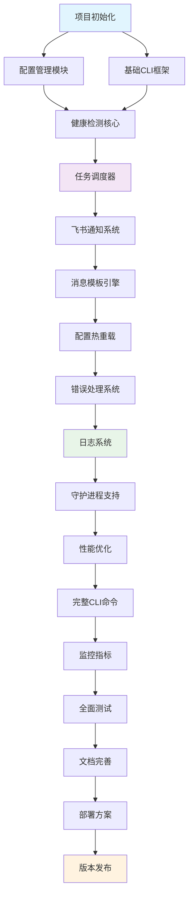
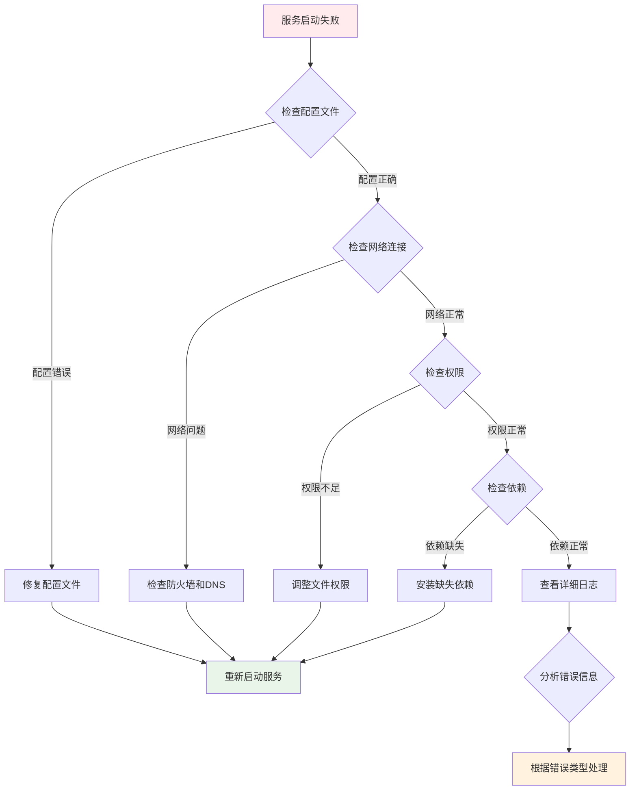

# Service Vitals 项目开发实施指南

## 文档概述

本实施指南基于 Service Vitals 开发文档，提供详细的、可执行的项目开发步骤。指南包含四个主要部分：任务拆解与实施步骤、循序渐进的实施计划、具体实施指导和质量控制检查点。

## 目录

1. [任务拆解与实施步骤](#1-任务拆解与实施步骤)
2. [循序渐进的实施计划](#2-循序渐进的实施计划)
3. [具体实施指导](#3-具体实施指导)
4. [质量控制检查点](#4-质量控制检查点)

---

## 1. 任务拆解与实施步骤

### 1.1 阶段1：基础架构和核心功能 (第1-3周)

#### 任务1.1：项目初始化

**步骤1.1.1：创建Rust项目结构**

- **输入：** 无
- **输出：** 
  - 完整的Cargo项目结构
  - 基础的`Cargo.toml`配置文件
  - 项目目录结构（按照架构文档第1.1节）
- **验收标准：** 
  - `cargo check` 命令执行成功
  - 项目目录结构与架构文档完全一致
  - `Cargo.toml`包含所有必需的依赖项
- **代码文件路径：**
  - `Cargo.toml` - 项目配置
  - `src/main.rs` - 程序入口点
  - `src/lib.rs` - 库入口
- **时间估算：** 2小时（包含项目结构创建和基础配置）
- **依赖关系：** 无
- **测试要求：** 
  - 执行`cargo test --lib`确保基础结构正确
  - 测试用例：`test_project_structure_exists`

**步骤1.1.2：配置开发环境和工具链**

- **输入：** 
  - 完成的项目结构
  - 开发环境要求（Rust 1.70+）
- **输出：**
  - 配置好的开发工具链
  - CI/CD基础配置文件
  - 代码格式化和静态分析配置
- **验收标准：**
  - `cargo clippy` 无警告
  - `cargo fmt --check` 通过
  - GitHub Actions基础流水线配置完成
- **代码文件路径：**
  - `.github/workflows/ci.yml` - CI配置
  - `rustfmt.toml` - 代码格式化配置
  - `clippy.toml` - 静态分析配置
- **时间估算：** 3小时（包含工具配置和CI设置）
- **依赖关系：** 步骤1.1.1
- **测试要求：**
  - CI流水线成功执行
  - 代码质量检查通过

#### 任务1.2：配置管理模块开发

**步骤1.2.1：定义配置数据结构**

- **输入：** 
  - 配置文件格式定义（开发文档第4章）
  - 项目基础结构
- **输出：**
  - `src/config/types.rs` - 完整的配置数据结构
  - 配置验证逻辑
  - 默认值处理
- **验收标准：**
  - 所有配置结构体实现`Serialize`和`Deserialize`
  - 配置验证函数覆盖所有必需字段
  - 单元测试覆盖率 ≥ 90%
- **代码文件路径：**
  - `src/config/types.rs::Config` - 主配置结构
  - `src/config/types.rs::GlobalConfig` - 全局配置
  - `src/config/types.rs::ServiceConfig` - 服务配置
  - `src/config/types.rs::validate_config()` - 验证函数
- **时间估算：** 4小时（包含结构定义、验证逻辑和测试）
- **依赖关系：** 步骤1.1.2
- **测试要求：**
  - 单元测试：`test_config_serialization`
  - 单元测试：`test_config_validation`
  - 单元测试：`test_default_values`

**步骤1.2.2：实现TOML文件解析**

- **输入：**
  - 配置数据结构（步骤1.2.1）
  - TOML示例文件
- **输出：**
  - `src/config/loader.rs` - 配置加载器实现
  - TOML解析和错误处理逻辑
  - 环境变量替换功能
- **验收标准：**
  - 能够正确解析所有示例配置文件
  - 环境变量替换功能正常工作
  - 错误信息清晰明确
- **代码文件路径：**
  - `src/config/loader.rs::ConfigLoader` - 加载器trait
  - `src/config/loader.rs::TomlConfigLoader` - TOML实现
  - `src/config/loader.rs::substitute_env_vars()` - 环境变量替换
- **时间估算：** 5小时（包含解析逻辑、环境变量处理和测试）
- **依赖关系：** 步骤1.2.1
- **测试要求：**
  - 单元测试：`test_toml_parsing`
  - 单元测试：`test_env_var_substitution`
  - 集成测试：`test_load_sample_config`

#### 任务1.3：健康检测核心功能

**步骤1.3.1：实现HTTP客户端封装**

- **输入：**
  - 配置数据结构
  - HTTP客户端需求（开发文档第6.1节）
- **输出：**
  - `src/health/checker.rs` - HTTP健康检测器
  - 请求构建和响应处理逻辑
  - 超时和重试机制
- **验收标准：**
  - 支持GET、POST、PUT、DELETE方法
  - 正确处理HTTP状态码验证
  - 响应时间测量精度 ≤ 1ms
- **代码文件路径：**
  - `src/health/checker.rs::HealthChecker` - 检测器trait
  - `src/health/checker.rs::HttpHealthChecker` - HTTP实现
  - `src/health/checker.rs::check()` - 检测方法
- **时间估算：** 6小时（包含HTTP客户端、错误处理和测试）
- **依赖关系：** 步骤1.2.2
- **测试要求：**
  - 单元测试：`test_http_get_request`
  - 单元测试：`test_status_code_validation`
  - 单元测试：`test_response_time_measurement`
  - 集成测试：`test_health_check_with_mock_server`

**步骤1.3.2：实现检测结果数据结构**

- **输入：**
  - 健康检测需求
  - 检测器实现
- **输出：**
  - `src/health/result.rs` - 检测结果结构
  - 结果序列化和存储逻辑
- **验收标准：**
  - 结果结构包含所有必需字段
  - 支持JSON和二进制序列化
  - 时间戳精度为毫秒级
- **代码文件路径：**
  - `src/health/result.rs::HealthResult` - 结果结构
  - `src/health/result.rs::HealthStatus` - 状态枚举
- **时间估算：** 2小时（包含结构定义和测试）
- **依赖关系：** 步骤1.3.1
- **测试要求：**
  - 单元测试：`test_health_result_serialization`
  - 单元测试：`test_health_status_enum`

#### 任务1.4：基础CLI框架

**步骤1.4.1：集成clap命令行解析**

- **输入：**
  - CLI设计文档（开发文档第5章）
  - 项目基础结构
- **输出：**
  - `src/cli/args.rs` - 命令行参数定义
  - `src/cli/commands.rs` - 命令处理逻辑
  - 基础命令实现（help, version, init）
- **验收标准：**
  - 所有命令行选项正确解析
  - 帮助信息格式正确
  - 版本信息显示正确
- **代码文件路径：**
  - `src/cli/args.rs::Args` - 参数结构
  - `src/cli/commands.rs::Command` - 命令trait
  - `src/cli/commands.rs::HelpCommand` - 帮助命令
  - `src/cli/commands.rs::InitCommand` - 初始化命令
- **时间估算：** 4小时（包含参数解析、命令实现和测试）
- **依赖关系：** 步骤1.2.2
- **测试要求：**
  - 单元测试：`test_args_parsing`
  - 单元测试：`test_help_command`
  - 单元测试：`test_init_command`

#### 任务1.5：任务调度器

**步骤1.5.1：设计和实现Scheduler**

- **输入：**
  - 健康检测器实现
  - 配置管理模块
- **输出：**
  - `src/health/scheduler.rs` - 任务调度器
  - 并发控制机制
  - 任务生命周期管理
- **验收标准：**
  - 支持并发检测 ≥ 100个服务
  - 任务调度精度 ≤ 1秒
  - 优雅关闭时间 ≤ 5秒
- **代码文件路径：**
  - `src/health/scheduler.rs::Scheduler` - 调度器trait
  - `src/health/scheduler.rs::TaskScheduler` - 实现
  - `src/health/scheduler.rs::start()` - 启动方法
  - `src/health/scheduler.rs::stop()` - 停止方法
- **时间估算：** 8小时（包含调度逻辑、并发控制和测试）
- **依赖关系：** 步骤1.3.2, 步骤1.4.1
- **测试要求：**
  - 单元测试：`test_scheduler_start_stop`
  - 单元测试：`test_concurrent_health_checks`
  - 集成测试：`test_scheduler_with_multiple_services`
  - 性能测试：`bench_scheduler_performance`

### 1.2 阶段2：通知系统和高级功能 (第4-6周)

#### 任务2.1：飞书通知系统

**步骤2.1.1：研究飞书webhook API**

- **输入：**
  - 飞书webhook API文档
  - 通知需求规范
- **输出：**
  - API调研报告
  - 消息格式规范文档
  - 测试用例设计
- **验收标准：**
  - 完成API调研文档
  - 确定消息格式和字段映射
  - 设计至少5个测试场景
- **代码文件路径：**
  - `docs/feishu-api-research.md` - 调研文档
- **时间估算：** 4小时（包含API研究和文档编写）
- **依赖关系：** 任务1.5完成
- **测试要求：**
  - 手动测试：验证飞书webhook接收消息
  - 文档审查：API调研文档完整性检查

**步骤2.1.2：实现NotificationSender trait**

- **输入：**
  - 飞书API调研结果
  - 通知系统设计（开发文档第6.2节）
- **输出：**
  - `src/notification/sender.rs` - 通知发送器接口
  - `src/notification/feishu.rs` - 飞书实现
  - 消息格式化和发送逻辑
- **验收标准：**
  - 支持文本和富文本消息
  - 发送成功率 ≥ 99%
  - 发送延迟 ≤ 2秒
- **代码文件路径：**
  - `src/notification/sender.rs::NotificationSender` - 发送器trait
  - `src/notification/feishu.rs::FeishuSender` - 飞书实现
  - `src/notification/feishu.rs::send()` - 发送方法
  - `src/notification/feishu.rs::format_message()` - 格式化方法
- **时间估算：** 6小时（包含接口设计、飞书实现和测试）
- **依赖关系：** 步骤2.1.1
- **测试要求：**
  - 单元测试：`test_feishu_message_formatting`
  - 单元测试：`test_feishu_send_success`
  - 单元测试：`test_feishu_send_failure_retry`
  - 集成测试：`test_feishu_webhook_integration`

#### 任务2.2：消息模板引擎

**步骤2.2.1：集成handlebars模板引擎**

- **输入：**
  - 消息模板需求
  - 通知发送器实现
- **输出：**
  - `src/notification/template.rs` - 模板处理器
  - 模板渲染和验证逻辑
  - 内置模板定义
- **验收标准：**
  - 支持变量替换和条件逻辑
  - 模板渲染性能 ≤ 10ms
  - 模板验证覆盖所有语法错误
- **代码文件路径：**
  - `src/notification/template.rs::MessageTemplate` - 模板trait
  - `src/notification/template.rs::HandlebarsTemplate` - 实现
  - `src/notification/template.rs::render()` - 渲染方法
  - `src/notification/template.rs::validate()` - 验证方法
- **时间估算：** 5小时（包含模板引擎集成和测试）
- **依赖关系：** 步骤2.1.2
- **测试要求：**
  - 单元测试：`test_template_variable_substitution`
  - 单元测试：`test_template_conditional_logic`
  - 单元测试：`test_template_validation`
  - 性能测试：`bench_template_rendering`

#### 任务2.3：配置热重载

**步骤2.3.1：实现ConfigWatcher组件**

- **输入：**
  - 配置管理模块
  - 文件监听需求
- **输出：**
  - `src/config/watcher.rs` - 配置监听器
  - 文件变化检测逻辑
  - 配置重载机制
- **验收标准：**
  - 文件变化检测延迟 ≤ 1秒
  - 配置重载成功率 ≥ 99%
  - 重载失败时保持原配置
- **代码文件路径：**
  - `src/config/watcher.rs::ConfigWatcher` - 监听器trait
  - `src/config/watcher.rs::FileWatcher` - 文件监听实现
  - `src/config/watcher.rs::watch()` - 监听方法
  - `src/config/watcher.rs::reload_config()` - 重载方法
- **时间估算：** 6小时（包含文件监听、重载逻辑和测试）
- **依赖关系：** 步骤2.2.1
- **测试要求：**
  - 单元测试：`test_file_change_detection`
  - 单元测试：`test_config_reload_success`
  - 单元测试：`test_config_reload_failure_rollback`
  - 集成测试：`test_hot_reload_integration`

### 1.3 错误处理和日志系统

#### 任务2.4：错误处理系统

**步骤2.4.1：定义错误类型层次结构**

- **输入：**
  - 错误处理设计（开发文档第7.1节）
  - 现有模块错误需求
- **输出：**
  - `src/error.rs` - 统一错误类型定义
  - 错误转换和传播逻辑
  - 错误上下文管理
- **验收标准：**
  - 所有模块错误统一处理
  - 错误信息包含足够上下文
  - 错误链追踪完整
- **代码文件路径：**
  - `src/error.rs::ServiceVitalsError` - 顶层错误
  - `src/error.rs::ConfigError` - 配置错误
  - `src/error.rs::HealthCheckError` - 检测错误
  - `src/error.rs::NotificationError` - 通知错误
- **时间估算：** 4小时（包含错误定义、转换逻辑和测试）
- **依赖关系：** 步骤2.3.1
- **测试要求：**
  - 单元测试：`test_error_conversion`
  - 单元测试：`test_error_context`
  - 单元测试：`test_error_chain`

#### 任务2.5：日志系统

**步骤2.5.1：实现结构化日志**

- **输入：**
  - 日志系统设计（开发文档第7.2节）
  - 错误处理系统
- **输出：**
  - `src/logging.rs` - 日志配置和管理
  - 结构化日志格式
  - 多目标日志输出
- **验收标准：**
  - 支持JSON和文本格式
  - 日志轮转功能正常
  - 日志性能影响 ≤ 5%
- **代码文件路径：**
  - `src/logging.rs::LoggingSystem` - 日志系统
  - `src/logging.rs::setup_logging()` - 初始化方法
  - `src/logging.rs::LogConfig` - 配置结构
- **时间估算：** 5小时（包含日志系统、格式化和测试）
- **依赖关系：** 步骤2.4.1
- **测试要求：**
  - 单元测试：`test_log_formatting`
  - 单元测试：`test_log_rotation`
  - 性能测试：`bench_logging_performance`

---

## 2. 循序渐进的实施计划

### 2.1 阶段划分依据

#### 阶段1：基础架构和核心功能 (第1-3周)
**目标：** 搭建项目基本框架，实现核心的健康检测功能
**范围：** 项目初始化、配置管理、健康检测、基础CLI、任务调度
**完成标志：** 能够通过CLI启动基本的健康检测服务

#### 阶段2：通知系统和高级功能 (第4-6周)
**目标：** 实现完整的通知系统和高级功能
**范围：** 飞书通知、消息模板、配置热重载、错误处理、日志系统
**完成标志：** 能够发送告警通知并支持配置热重载

#### 阶段3：跨平台支持和优化 (第7-9周)
**目标：** 实现跨平台兼容性和性能优化
**范围：** 守护进程、Windows服务、性能优化、完整CLI、监控指标
**完成标志：** 支持所有目标平台的守护进程模式

#### 阶段4：测试、文档和发布 (第10-12周)
**目标：** 完善测试覆盖、文档和发布准备
**范围：** 全面测试、文档完善、部署方案、CI/CD、版本发布
**完成标志：** 通过所有测试并完成首个正式版本发布

### 2.2 任务依赖关系图



### 2.3 关键决策点和决策矩阵

#### 决策点1：HTTP客户端库选择

| 方案    | 性能 | 功能完整性 | 社区支持 | 学习成本 | 推荐指数 |
| ------- | ---- | ---------- | -------- | -------- | -------- |
| reqwest | 9    | 9          | 9        | 7        | ⭐⭐⭐⭐⭐    |
| hyper   | 10   | 8          | 8        | 5        | ⭐⭐⭐⭐     |
| curl    | 8    | 7          | 9        | 6        | ⭐⭐⭐      |

**推荐方案：** reqwest - 功能完整，易于使用，社区活跃

#### 决策点2：配置文件格式

| 方案 | 可读性 | 功能性 | 生态系统 | 解析性能 | 推荐指数 |
| ---- | ------ | ------ | -------- | -------- | -------- |
| TOML | 9      | 8      | 8        | 8        | ⭐⭐⭐⭐⭐    |
| YAML | 8      | 9      | 9        | 7        | ⭐⭐⭐⭐     |
| JSON | 7      | 7      | 10       | 9        | ⭐⭐⭐      |

**推荐方案：** TOML - 可读性好，功能足够，符合Rust生态

#### 决策点3：日志库选择

| 方案             | 性能 | 功能 | 配置灵活性 | 生态兼容 | 推荐指数 |
| ---------------- | ---- | ---- | ---------- | -------- | -------- |
| log + env_logger | 8    | 7    | 8          | 10       | ⭐⭐⭐⭐⭐    |
| tracing          | 9    | 10   | 9          | 8        | ⭐⭐⭐⭐     |
| slog             | 9    | 9    | 10         | 6        | ⭐⭐⭐      |

**推荐方案：** log + env_logger - 标准库，生态兼容性最好

### 2.4 风险评估表

| 风险描述                 | 可能性 | 影响程度 | 风险等级 | 应对措施                     |
| ------------------------ | ------ | -------- | -------- | ---------------------------- |
| 跨平台兼容性问题         | 中     | 高       | 🔴 高     | 早期多平台测试，使用条件编译 |
| 第三方依赖更新破坏性变更 | 低     | 中       | 🟡 中     | 锁定版本，定期更新测试       |
| 性能不达预期             | 低     | 中       | 🟡 中     | 持续性能监控，及时优化       |
| 团队成员技能不足         | 中     | 中       | 🟡 中     | 技术培训，代码审查           |
| 需求变更                 | 中     | 低       | 🟢 低     | 模块化设计，保持灵活性       |
| 开发进度延期             | 中     | 中       | 🟡 中     | 合理任务分解，预留缓冲时间   |

### 2.5 阶段完成标志

#### 阶段1完成标志
- [ ] 所有基础模块单元测试通过率 ≥ 90%
- [ ] 能够通过CLI启动健康检测服务
- [ ] 基础配置文件解析正常工作
- [ ] 至少支持10个并发健康检测
- [ ] 代码覆盖率 ≥ 80%

#### 阶段2完成标志
- [ ] 飞书通知功能正常工作
- [ ] 配置热重载功能验证通过
- [ ] 错误处理覆盖所有模块
- [ ] 日志系统支持多种输出格式
- [ ] 集成测试通过率 ≥ 95%

#### 阶段3完成标志
- [ ] 支持Linux/Windows/macOS三个平台
- [ ] 守护进程模式正常工作
- [ ] 性能指标达到设计要求
- [ ] 完整CLI命令集实现
- [ ] 跨平台兼容性测试通过

#### 阶段4完成标志
- [ ] 测试覆盖率 ≥ 90%
- [ ] 所有文档完整且准确
- [ ] 部署方案验证通过
- [ ] CI/CD流水线正常工作
- [ ] 首个版本成功发布

---

## 3. 具体实施指导

### 3.1 代码骨架和接口定义

#### 3.1.1 配置管理模块骨架

```rust
// src/config/types.rs
use serde::{Deserialize, Serialize};
use std::collections::HashMap;

/// 主配置结构，包含全局配置和服务列表
#[derive(Debug, Clone, Serialize, Deserialize)]
pub struct Config {
    /// 全局配置项
    pub global: GlobalConfig,
    /// 服务配置列表
    pub services: Vec<ServiceConfig>,
}

/// 全局配置结构
#[derive(Debug, Clone, Serialize, Deserialize)]
pub struct GlobalConfig {
    /// 默认飞书webhook URL
    pub default_feishu_webhook_url: Option<String>,
    /// 消息模板
    pub message_template: Option<String>,
    /// 检测间隔（秒）
    #[serde(default = "default_check_interval")]
    pub check_interval_seconds: u64,
    /// 日志级别
    #[serde(default = "default_log_level")]
    pub log_level: String,
    /// 请求超时时间（秒）
    #[serde(default = "default_timeout")]
    pub request_timeout_seconds: u64,
    /// 最大并发检测数
    #[serde(default = "default_max_concurrent")]
    pub max_concurrent_checks: usize,
    /// 全局请求头
    #[serde(default)]
    pub headers: HashMap<String, String>,
}

/// 服务配置结构
#[derive(Debug, Clone, Serialize, Deserialize)]
pub struct ServiceConfig {
    /// 服务名称
    pub name: String,
    /// 服务URL
    pub url: String,
    /// HTTP方法
    #[serde(default = "default_method")]
    pub method: String,
    /// 期望的状态码列表
    pub expected_status_codes: Vec<u16>,
    /// 服务特定的飞书webhook URL
    pub feishu_webhook_url: Option<String>,
    /// 失败阈值
    #[serde(default = "default_failure_threshold")]
    pub failure_threshold: u32,
    /// 服务特定的检测间隔
    pub check_interval_seconds: Option<u64>,
    /// 是否启用
    #[serde(default = "default_enabled")]
    pub enabled: bool,
    /// 服务描述
    pub description: Option<String>,
    /// 服务特定的请求头
    #[serde(default)]
    pub headers: HashMap<String, String>,
    /// 请求体（用于POST/PUT请求）
    pub body: Option<serde_json::Value>,
}

// 默认值函数
fn default_check_interval() -> u64 { 60 }
fn default_log_level() -> String { "info".to_string() }
fn default_timeout() -> u64 { 10 }
fn default_max_concurrent() -> usize { 50 }
fn default_method() -> String { "GET".to_string() }
fn default_failure_threshold() -> u32 { 1 }
fn default_enabled() -> bool { true }

/// 配置验证函数
///
/// # 参数
/// * `config` - 要验证的配置
///
/// # 返回
/// * `Result<(), String>` - 验证结果，错误时返回错误信息
pub fn validate_config(config: &Config) -> Result<(), String> {
    // 验证全局配置
    if config.global.check_interval_seconds == 0 {
        return Err("检测间隔不能为0".to_string());
    }

    if config.global.request_timeout_seconds == 0 {
        return Err("请求超时时间不能为0".to_string());
    }

    // 验证服务配置
    if config.services.is_empty() {
        return Err("至少需要配置一个服务".to_string());
    }

    for service in &config.services {
        // 验证服务名称
        if service.name.trim().is_empty() {
            return Err("服务名称不能为空".to_string());
        }

        // 验证URL格式
        if !service.url.starts_with("http://") && !service.url.starts_with("https://") {
            return Err(format!("服务 {} 的URL格式无效", service.name));
        }

        // 验证状态码
        if service.expected_status_codes.is_empty() {
            return Err(format!("服务 {} 必须指定期望的状态码", service.name));
        }

        for &code in &service.expected_status_codes {
            if code < 100 || code > 599 {
                return Err(format!("服务 {} 的状态码 {} 无效", service.name, code));
            }
        }

        // 验证HTTP方法
        let valid_methods = ["GET", "POST", "PUT", "DELETE", "HEAD", "OPTIONS"];
        if !valid_methods.contains(&service.method.as_str()) {
            return Err(format!("服务 {} 的HTTP方法 {} 无效", service.name, service.method));
        }
    }

    Ok(())
}

#[cfg(test)]
mod tests {
    use super::*;

    #[test]
    fn test_config_serialization() {
        // 测试配置序列化和反序列化
    }

    #[test]
    fn test_config_validation() {
        // 测试配置验证逻辑
    }

    #[test]
    fn test_default_values() {
        // 测试默认值设置
    }
}
```

#### 3.1.2 健康检测模块骨架

```rust
// src/health/checker.rs
use crate::config::ServiceConfig;
use crate::health::result::{HealthResult, HealthStatus};
use async_trait::async_trait;
use reqwest::Client;
use std::time::{Duration, Instant};
use tokio::time::timeout;

/// 健康检测器trait，定义检测接口
#[async_trait]
pub trait HealthChecker: Send + Sync {
    /// 执行健康检测
    ///
    /// # 参数
    /// * `service` - 服务配置
    ///
    /// # 返回
    /// * `Result<HealthResult, Box<dyn std::error::Error>>` - 检测结果
    async fn check(&self, service: &ServiceConfig) -> Result<HealthResult, Box<dyn std::error::Error>>;

    /// 带超时的健康检测
    ///
    /// # 参数
    /// * `service` - 服务配置
    /// * `timeout_duration` - 超时时间
    ///
    /// # 返回
    /// * `Result<HealthResult, Box<dyn std::error::Error>>` - 检测结果
    async fn check_with_timeout(
        &self,
        service: &ServiceConfig,
        timeout_duration: Duration
    ) -> Result<HealthResult, Box<dyn std::error::Error>>;
}

/// HTTP健康检测器实现
pub struct HttpHealthChecker {
    /// HTTP客户端
    client: Client,
    /// 默认超时时间
    default_timeout: Duration,
}

impl HttpHealthChecker {
    /// 创建新的HTTP健康检测器
    ///
    /// # 参数
    /// * `timeout` - 默认超时时间
    ///
    /// # 返回
    /// * `Self` - 检测器实例
    pub fn new(timeout: Duration) -> Self {
        let client = Client::builder()
            .timeout(timeout)
            .build()
            .expect("Failed to create HTTP client");

        Self {
            client,
            default_timeout: timeout,
        }
    }

    /// 构建HTTP请求
    ///
    /// # 参数
    /// * `service` - 服务配置
    ///
    /// # 返回
    /// * `reqwest::RequestBuilder` - 请求构建器
    fn build_request(&self, service: &ServiceConfig) -> reqwest::RequestBuilder {
        let mut request = match service.method.as_str() {
            "GET" => self.client.get(&service.url),
            "POST" => self.client.post(&service.url),
            "PUT" => self.client.put(&service.url),
            "DELETE" => self.client.delete(&service.url),
            "HEAD" => self.client.head(&service.url),
            _ => self.client.get(&service.url), // 默认使用GET
        };

        // 添加请求头
        for (key, value) in &service.headers {
            request = request.header(key, value);
        }

        // 添加请求体（如果有）
        if let Some(body) = &service.body {
            request = request.json(body);
        }

        request
    }

    /// 验证响应状态码
    ///
    /// # 参数
    /// * `status_code` - 实际状态码
    /// * `expected_codes` - 期望的状态码列表
    ///
    /// # 返回
    /// * `bool` - 是否匹配
    fn validate_status_code(&self, status_code: u16, expected_codes: &[u16]) -> bool {
        expected_codes.contains(&status_code)
    }
}

#[async_trait]
impl HealthChecker for HttpHealthChecker {
    async fn check(&self, service: &ServiceConfig) -> Result<HealthResult, Box<dyn std::error::Error>> {
        self.check_with_timeout(service, self.default_timeout).await
    }

    async fn check_with_timeout(
        &self,
        service: &ServiceConfig,
        timeout_duration: Duration
    ) -> Result<HealthResult, Box<dyn std::error::Error>> {
        let start_time = Instant::now();

        // 构建请求
        let request = self.build_request(service);

        // 执行请求（带超时）
        let response_result = timeout(timeout_duration, request.send()).await;

        let response_time = start_time.elapsed();

        match response_result {
            Ok(Ok(response)) => {
                let status_code = response.status().as_u16();
                let is_healthy = self.validate_status_code(status_code, &service.expected_status_codes);

                Ok(HealthResult {
                    service_name: service.name.clone(),
                    service_url: service.url.clone(),
                    timestamp: chrono::Utc::now(),
                    status: if is_healthy { HealthStatus::Up } else { HealthStatus::Down },
                    status_code: Some(status_code),
                    response_time,
                    error_message: if is_healthy {
                        None
                    } else {
                        Some(format!("状态码不匹配: 期望 {:?}, 实际 {}", service.expected_status_codes, status_code))
                    },
                    consecutive_failures: 0, // 这个值由调度器管理
                })
            }
            Ok(Err(e)) => {
                Ok(HealthResult {
                    service_name: service.name.clone(),
                    service_url: service.url.clone(),
                    timestamp: chrono::Utc::now(),
                    status: HealthStatus::Down,
                    status_code: None,
                    response_time,
                    error_message: Some(e.to_string()),
                    consecutive_failures: 0,
                })
            }
            Err(_) => {
                Ok(HealthResult {
                    service_name: service.name.clone(),
                    service_url: service.url.clone(),
                    timestamp: chrono::Utc::now(),
                    status: HealthStatus::Down,
                    status_code: None,
                    response_time,
                    error_message: Some("请求超时".to_string()),
                    consecutive_failures: 0,
                })
            }
        }
    }
}

#[cfg(test)]
mod tests {
    use super::*;

    #[tokio::test]
    async fn test_http_get_request() {
        // 测试HTTP GET请求
    }

    #[tokio::test]
    async fn test_status_code_validation() {
        // 测试状态码验证
    }

    #[tokio::test]
    async fn test_response_time_measurement() {
        // 测试响应时间测量
    }
}
```

### 3.2 配置文件示例和路径规范

#### 3.2.1 基础配置文件示例

**文件路径：** `examples/config.toml`

```toml
# Service Vitals 配置文件示例
# 详细配置说明请参考文档

[global]
# 默认飞书webhook URL（可选）
# 如果服务没有单独配置webhook，将使用此URL
default_feishu_webhook_url = "https://open.feishu.cn/open-apis/bot/v2/hook/your-webhook-token"

# 消息模板（可选，使用Handlebars语法）
# 支持的变量：service_name, service_url, status_code, response_time, timestamp, error_message
message_template = """
🚨 **服务告警**
- **服务名称**: {{service_name}}
- **服务URL**: {{service_url}}
- **状态码**: {{#if status_code}}{{status_code}}{{else}}N/A{{/if}}
- **响应时间**: {{response_time}}ms
- **检测时间**: {{timestamp}}
{{#if error_message}}
- **错误信息**: {{error_message}}
{{/if}}
"""

# 全局检测间隔，单位秒（默认60）
check_interval_seconds = 30

# 日志级别（可选，默认"info"）
# 支持：debug, info, warn, error
log_level = "info"

# 请求超时时间，单位秒（默认10）
request_timeout_seconds = 10

# 最大并发检测数（默认50）
max_concurrent_checks = 100

# 失败重试次数（默认3）
retry_attempts = 3

# 重试间隔，单位秒（默认5）
retry_delay_seconds = 5

# 全局请求头（可选）
[global.headers]
"User-Agent" = "ServiceVitals/1.0"
"Accept" = "application/json"

# 服务配置列表
[[services]]
name = "主站API"
url = "https://api.example.com/health"
method = "GET"
expected_status_codes = [200, 201]
failure_threshold = 2
check_interval_seconds = 60  # 覆盖全局配置
enabled = true
description = "主站API健康检测"

# 服务特定的请求头
[services.headers]
"Authorization" = "Bearer ${API_TOKEN}"
"Content-Type" = "application/json"

[[services]]
name = "用户服务"
url = "https://user-service.example.com/ping"
method = "POST"
expected_status_codes = [200]
feishu_webhook_url = "https://open.feishu.cn/open-apis/bot/v2/hook/user-service-webhook"
failure_threshold = 1
enabled = true

# POST请求体（可选）
[services.body]
ping = "pong"
timestamp = "{{timestamp}}"

[[services]]
name = "数据库连接检查"
url = "http://localhost:8080/db/health"
method = "GET"
expected_status_codes = [200]
failure_threshold = 3
enabled = true
description = "数据库连接健康检测"
```

#### 3.2.2 测试配置文件示例

**文件路径：** `tests/data/configs/test_config.toml`

```toml
[global]
check_interval_seconds = 5
log_level = "debug"
request_timeout_seconds = 5
max_concurrent_checks = 10

[[services]]
name = "测试服务"
url = "http://localhost:8080/health"
method = "GET"
expected_status_codes = [200]
failure_threshold = 1
enabled = true
```

#### 3.2.3 最小配置文件示例

**文件路径：** `examples/minimal_config.toml`

```toml
[global]
# 最小配置只需要指定必要的全局设置

[[services]]
name = "示例服务"
url = "https://httpbin.org/status/200"
expected_status_codes = [200]
```

### 3.3 跨平台兼容性实现指导

#### 3.3.1 条件编译指令使用

```rust
// src/daemon/mod.rs
#[cfg(unix)]
pub mod unix;

#[cfg(windows)]
pub mod windows;

#[cfg(unix)]
pub use unix::UnixDaemon as PlatformDaemon;

#[cfg(windows)]
pub use windows::WindowsService as PlatformDaemon;

/// 跨平台守护进程管理器
pub struct DaemonManager {
    #[cfg(unix)]
    daemon: UnixDaemon,

    #[cfg(windows)]
    service: WindowsService,
}

impl DaemonManager {
    /// 创建平台特定的守护进程管理器
    pub fn new() -> Self {
        Self {
            #[cfg(unix)]
            daemon: UnixDaemon::new(),

            #[cfg(windows)]
            service: WindowsService::new(),
        }
    }

    /// 启动守护进程
    pub fn start(&self) -> Result<(), Box<dyn std::error::Error>> {
        #[cfg(unix)]
        return self.daemon.start();

        #[cfg(windows)]
        return self.service.start();
    }
}
```

#### 3.3.2 跨平台路径处理

```rust
// src/utils.rs
use std::path::{Path, PathBuf};

/// 获取配置文件默认路径
pub fn get_default_config_path() -> PathBuf {
    #[cfg(unix)]
    {
        // Linux/macOS: /etc/service-vitals/config.toml 或 ~/.config/service-vitals/config.toml
        if let Some(config_dir) = dirs::config_dir() {
            config_dir.join("service-vitals").join("config.toml")
        } else {
            PathBuf::from("/etc/service-vitals/config.toml")
        }
    }

    #[cfg(windows)]
    {
        // Windows: %APPDATA%\ServiceVitals\config.toml
        if let Some(config_dir) = dirs::config_dir() {
            config_dir.join("ServiceVitals").join("config.toml")
        } else {
            PathBuf::from("C:\\ProgramData\\ServiceVitals\\config.toml")
        }
    }
}

/// 获取日志文件默认路径
pub fn get_default_log_path() -> PathBuf {
    #[cfg(unix)]
    {
        PathBuf::from("/var/log/service-vitals/service-vitals.log")
    }

    #[cfg(windows)]
    {
        if let Some(data_dir) = dirs::data_local_dir() {
            data_dir.join("ServiceVitals").join("logs").join("service-vitals.log")
        } else {
            PathBuf::from("C:\\ProgramData\\ServiceVitals\\logs\\service-vitals.log")
        }
    }
}

/// 获取PID文件路径
pub fn get_pid_file_path() -> PathBuf {
    #[cfg(unix)]
    {
        PathBuf::from("/var/run/service-vitals.pid")
    }

    #[cfg(windows)]
    {
        // Windows不使用PID文件，返回临时路径
        std::env::temp_dir().join("service-vitals.pid")
    }
}
```

#### 3.3.3 兼容性测试用例

```rust
// tests/cross_platform_tests.rs
#[cfg(test)]
mod cross_platform_tests {
    use super::*;

    #[test]
    fn test_config_path_exists() {
        let config_path = get_default_config_path();
        assert!(config_path.is_absolute());

        #[cfg(unix)]
        assert!(config_path.to_string_lossy().contains("service-vitals"));

        #[cfg(windows)]
        assert!(config_path.to_string_lossy().contains("ServiceVitals"));
    }

    #[test]
    fn test_log_path_format() {
        let log_path = get_default_log_path();
        assert!(log_path.is_absolute());
        assert!(log_path.extension().unwrap() == "log");
    }

    #[cfg(unix)]
    #[test]
    fn test_unix_daemon_creation() {
        let daemon = UnixDaemon::new();
        assert!(daemon.is_ok());
    }

    #[cfg(windows)]
    #[test]
    fn test_windows_service_creation() {
        let service = WindowsService::new();
        assert!(service.is_ok());
    }
}
```

### 3.4 调试和故障排查指导

#### 3.4.1 调试技巧

**1. 启用详细日志**

```bash
# Linux/macOS (Bash)
export RUST_LOG=debug
export SERVICE_VITALS_LOG_LEVEL=debug
./service-vitals start --config config.toml
```

```powershell
# Windows (PowerShell)
$env:RUST_LOG = "debug"
$env:SERVICE_VITALS_LOG_LEVEL = "debug"
.\service-vitals.exe start --config config.toml
```

**2. 使用调试器**

```bash
# Linux/macOS (Bash) - 使用GDB
gdb --args ./service-vitals start --config config.toml
(gdb) run
(gdb) bt  # 查看调用栈

# 使用LLDB
lldb ./service-vitals -- start --config config.toml
(lldb) run
(lldb) bt  # 查看调用栈
```

```powershell
# Windows (PowerShell) - 使用Visual Studio调试器
# 在Visual Studio中打开项目，设置断点后按F5调试
```

**3. 性能分析**

```bash
# Linux/macOS (Bash) - 使用perf
perf record ./service-vitals start --config config.toml
perf report

# 使用valgrind检查内存泄漏
valgrind --leak-check=full ./service-vitals start --config config.toml
```

#### 3.4.2 故障排查流程图



#### 3.4.3 常见问题解决方案

**问题1：配置文件解析失败**

```
错误信息：TOML parse error at line 15, column 1
解决方案：
1. 检查TOML语法是否正确
2. 验证字符编码为UTF-8
3. 检查是否有多余的逗号或引号
```

**问题2：网络连接超时**

```
错误信息：Request timeout after 10 seconds
解决方案：
1. 增加request_timeout_seconds配置
2. 检查目标服务是否可达
3. 验证防火墙设置
4. 检查DNS解析
```

**问题3：权限不足**

```
错误信息：Permission denied
解决方案：
Linux/macOS:
sudo chown -R vitals:vitals /etc/service-vitals
sudo chmod 600 /etc/service-vitals/config.toml

Windows:
以管理员身份运行PowerShell
icacls "C:\ProgramData\ServiceVitals" /grant Users:F
```

**问题4：端口占用**

```
错误信息：Address already in use
解决方案：
Linux/macOS:
netstat -tulpn | grep :8080
kill -9 <PID>

Windows:
netstat -ano | findstr :8080
taskkill /PID <PID> /F
```

---

## 4. 质量控制检查点

### 4.1 阶段验收标准

#### 4.1.1 阶段1验收标准

**代码质量指标：**
- [ ] 单元测试覆盖率 ≥ 90%
- [ ] 代码静态分析无严重警告
- [ ] 所有公共API有完整文档注释
- [ ] 代码审查通过率 100%

**功能验收标准：**
- [ ] 配置文件解析功能完整且正确
- [ ] 健康检测核心功能正常工作
- [ ] CLI基础命令（help, version, init, start）正常工作
- [ ] 任务调度器支持至少10个并发检测
- [ ] 错误处理覆盖所有异常情况

**性能验收标准：**
- [ ] 单次健康检测响应时间 ≤ 5秒
- [ ] 内存使用 ≤ 30MB（空载状态）
- [ ] CPU使用率 ≤ 5%（空载状态）

#### 4.1.2 阶段2验收标准

**代码质量指标：**
- [ ] 单元测试覆盖率 ≥ 90%
- [ ] 集成测试覆盖率 ≥ 80%
- [ ] 代码复杂度符合标准（圈复杂度 ≤ 10）
- [ ] 无内存泄漏和资源泄漏

**功能验收标准：**
- [ ] 飞书通知功能正常工作
- [ ] 消息模板渲染正确
- [ ] 配置热重载功能验证通过
- [ ] 错误处理和日志系统完整
- [ ] 支持多种日志输出格式

**性能验收标准：**
- [ ] 通知发送延迟 ≤ 2秒
- [ ] 配置重载时间 ≤ 1秒
- [ ] 日志性能影响 ≤ 5%

#### 4.1.3 阶段3验收标准

**代码质量指标：**
- [ ] 跨平台兼容性测试通过
- [ ] 性能基准测试达标
- [ ] 安全扫描无高危漏洞
- [ ] 文档完整性检查通过

**功能验收标准：**
- [ ] 支持Linux/Windows/macOS三个平台
- [ ] 守护进程模式正常工作
- [ ] 完整CLI命令集实现
- [ ] 监控指标正确收集和导出
- [ ] 系统服务安装/卸载正常

**性能验收标准：**
- [ ] 支持100+并发健康检测
- [ ] 内存使用 ≤ 50MB（满载状态）
- [ ] 启动时间 ≤ 3秒

#### 4.1.4 阶段4验收标准

**代码质量指标：**
- [ ] 总体测试覆盖率 ≥ 90%
- [ ] 所有文档完整且准确
- [ ] CI/CD流水线正常工作
- [ ] 发布包构建成功

**功能验收标准：**
- [ ] 所有功能端到端测试通过
- [ ] 部署方案验证成功
- [ ] 用户手册和API文档完整
- [ ] 版本发布流程验证通过

### 4.2 代码审查Checklist

#### 4.2.1 代码风格检查

**Rust代码规范：**
- [ ] 使用`cargo fmt`格式化代码
- [ ] 遵循Rust命名约定（snake_case, PascalCase等）
- [ ] 函数长度不超过50行
- [ ] 文件长度不超过800行
- [ ] 适当使用注释解释复杂逻辑

**文档注释要求：**
- [ ] 所有公共函数有文档注释
- [ ] 文档注释包含参数说明
- [ ] 文档注释包含返回值说明
- [ ] 文档注释包含示例代码（如适用）
- [ ] 使用`cargo doc`生成文档无警告

#### 4.2.2 代码质量检查

**错误处理：**
- [ ] 使用适当的错误类型
- [ ] 错误信息清晰明确
- [ ] 避免使用`unwrap()`和`expect()`（除非确保安全）
- [ ] 正确传播错误
- [ ] 资源清理正确实现

**性能考虑：**
- [ ] 避免不必要的内存分配
- [ ] 使用适当的数据结构
- [ ] 避免阻塞操作
- [ ] 正确使用异步编程
- [ ] 避免死锁和竞态条件

**安全检查：**
- [ ] 输入验证完整
- [ ] 避免SQL注入和XSS
- [ ] 敏感信息不硬编码
- [ ] 使用安全的随机数生成
- [ ] 正确处理用户权限

#### 4.2.3 测试质量检查

**测试覆盖：**
- [ ] 单元测试覆盖所有公共函数
- [ ] 测试覆盖正常和异常情况
- [ ] 边界条件测试完整
- [ ] 集成测试覆盖主要流程
- [ ] 性能测试验证关键指标

**测试质量：**
- [ ] 测试用例独立且可重复
- [ ] 测试数据与生产数据隔离
- [ ] 使用Mock避免外部依赖
- [ ] 测试断言明确具体
- [ ] 测试失败信息清晰

### 4.3 测试覆盖率目标

#### 4.3.1 单元测试覆盖率目标

| 模块         | 覆盖率目标 | 关键测试用例                   |
| ------------ | ---------- | ------------------------------ |
| config       | ≥ 95%      | 配置解析、验证、环境变量替换   |
| health       | ≥ 90%      | HTTP请求、状态码验证、超时处理 |
| notification | ≥ 90%      | 消息格式化、发送重试、模板渲染 |
| cli          | ≥ 85%      | 参数解析、命令执行、错误处理   |
| daemon       | ≥ 80%      | 进程管理、信号处理、服务控制   |
| error        | ≥ 95%      | 错误转换、错误链、上下文管理   |
| logging      | ≥ 85%      | 日志格式化、轮转、多目标输出   |

#### 4.3.2 集成测试覆盖率目标

| 测试场景       | 覆盖率目标 | 验证内容                     |
| -------------- | ---------- | ---------------------------- |
| 端到端健康检测 | ≥ 90%      | 完整检测流程、结果记录       |
| 配置热重载     | ≥ 85%      | 文件监听、配置更新、任务重启 |
| 通知发送       | ≥ 90%      | 告警触发、消息发送、重试机制 |
| CLI命令        | ≥ 85%      | 所有命令执行、参数处理       |
| 跨平台兼容性   | ≥ 80%      | 多平台功能验证               |

#### 4.3.3 系统测试覆盖率目标

| 测试类型   | 覆盖率目标 | 测试内容           |
| ---------- | ---------- | ------------------ |
| 功能测试   | 100%       | 所有用户故事和需求 |
| 性能测试   | ≥ 80%      | 关键性能指标验证   |
| 兼容性测试 | 100%       | 所有目标平台       |
| 安全测试   | ≥ 90%      | 常见安全漏洞检查   |
| 可用性测试 | ≥ 80%      | 用户体验验证       |

### 4.4 性能指标定义

#### 4.4.1 响应时间指标

| 指标名称         | 目标值 | 测量方法             | 验收标准           |
| ---------------- | ------ | -------------------- | ------------------ |
| 健康检测响应时间 | ≤ 5秒  | 从发送请求到接收响应 | 95%的请求满足要求  |
| 通知发送延迟     | ≤ 2秒  | 从检测失败到发送通知 | 99%的通知满足要求  |
| 配置重载时间     | ≤ 1秒  | 从文件变化到配置生效 | 100%的重载满足要求 |
| 应用启动时间     | ≤ 3秒  | 从启动到服务就绪     | 100%的启动满足要求 |

#### 4.4.2 吞吐量指标

| 指标名称   | 目标值    | 测量方法           | 验收标准       |
| ---------- | --------- | ------------------ | -------------- |
| 并发检测数 | ≥ 100个   | 同时进行的健康检测 | 稳定运行1小时  |
| 检测频率   | ≥ 1次/秒  | 每秒完成的检测次数 | 平均值满足要求 |
| 通知发送率 | ≥ 10次/秒 | 每秒发送的通知数量 | 峰值处理能力   |

#### 4.4.3 资源使用指标

| 指标名称         | 目标值      | 测量方法         | 验收标准       |
| ---------------- | ----------- | ---------------- | -------------- |
| 内存使用（空载） | ≤ 30MB      | RSS内存使用量    | 稳定运行24小时 |
| 内存使用（满载） | ≤ 50MB      | 100个并发检测时  | 稳定运行1小时  |
| CPU使用（空载）  | ≤ 5%        | 平均CPU使用率    | 5分钟平均值    |
| CPU使用（满载）  | ≤ 30%       | 100个并发检测时  | 5分钟平均值    |
| 磁盘IO           | ≤ 10MB/小时 | 日志和配置文件IO | 正常运行状态   |

### 4.5 质量门禁规则

#### 4.5.1 代码提交门禁

**必须满足的条件：**
- [ ] 所有单元测试通过
- [ ] 代码覆盖率不低于当前基线
- [ ] `cargo clippy`无警告
- [ ] `cargo fmt --check`通过
- [ ] 代码审查通过（至少1人审查）

**可选但推荐的条件：**
- [ ] 集成测试通过
- [ ] 性能测试无回归
- [ ] 文档更新完整
- [ ] 变更日志更新

#### 4.5.2 版本发布门禁

**必须满足的条件：**
- [ ] 所有测试通过（单元、集成、系统）
- [ ] 代码覆盖率 ≥ 90%
- [ ] 性能指标达到要求
- [ ] 安全扫描通过
- [ ] 文档完整且准确
- [ ] 跨平台兼容性验证通过

**发布检查清单：**
- [ ] 版本号更新正确
- [ ] 变更日志完整
- [ ] 发布说明准备完毕
- [ ] 构建产物验证通过
- [ ] 部署脚本测试通过

### 4.6 验收报告模板

#### 4.6.1 阶段验收报告模板

```markdown
# Service Vitals 阶段X验收报告

## 基本信息
- **阶段名称：** [阶段名称]
- **验收日期：** [YYYY-MM-DD]
- **验收人员：** [验收人员列表]
- **项目版本：** [版本号]

## 验收结果概述
- **总体结果：** ✅通过 / ❌不通过
- **完成度：** [X]%
- **质量评分：** [X]/10

## 详细验收结果

### 功能验收
| 功能项  | 验收标准 | 实际结果 | 状态 | 备注    |
| ------- | -------- | -------- | ---- | ------- |
| [功能1] | [标准1]  | [结果1]  | ✅/❌  | [备注1] |
| [功能2] | [标准2]  | [结果2]  | ✅/❌  | [备注2] |

### 质量指标验收
| 指标类型   | 目标值 | 实际值 | 状态 | 备注   |
| ---------- | ------ | ------ | ---- | ------ |
| 代码覆盖率 | ≥90%   | [X]%   | ✅/❌  | [备注] |
| 性能指标   | [目标] | [实际] | ✅/❌  | [备注] |

### 问题和风险
| 问题描述 | 严重程度 | 影响范围 | 解决方案 | 负责人 | 预计解决时间 |
| -------- | -------- | -------- | -------- | ------ | ------------ |
| [问题1]  | 高/中/低 | [范围]   | [方案]   | [人员] | [时间]       |

### 下一步行动
- [ ] [行动项1]
- [ ] [行动项2]
- [ ] [行动项3]

## 验收结论
[详细的验收结论和建议]

---
**验收人签字：** [签字]
**日期：** [YYYY-MM-DD]
```

---

## 总结

本Service Vitals项目开发实施指南提供了完整的、可执行的开发路径，包含：

1. **详细的任务拆解** - 每个步骤都有明确的输入、输出、验收标准和时间估算
2. **循序渐进的实施计划** - 4个阶段的清晰划分和依赖关系管理
3. **具体的实施指导** - 代码骨架、配置示例和跨平台兼容性指导
4. **严格的质量控制** - 全面的验收标准、代码审查要求和质量门禁

开发团队可以按照本指南逐步完成Service Vitals项目的开发，确保项目按时、高质量地交付。每个阶段都有明确的完成标志和验收标准，便于项目管理和质量控制。
